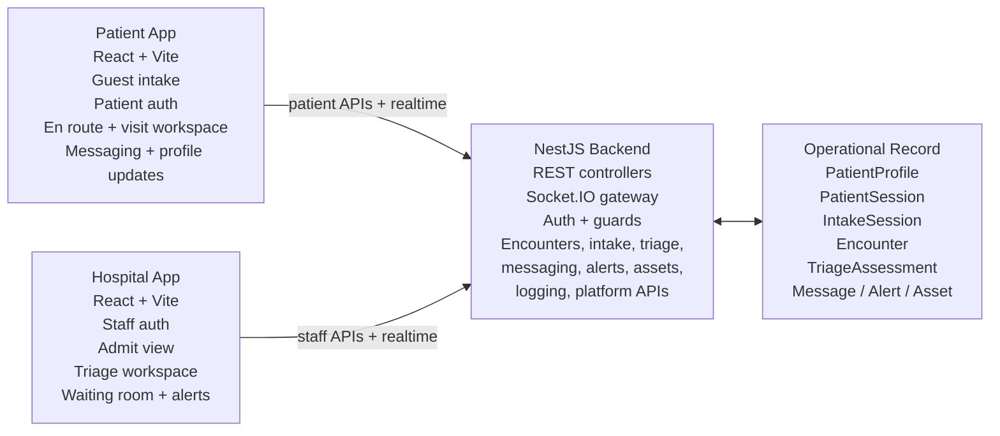
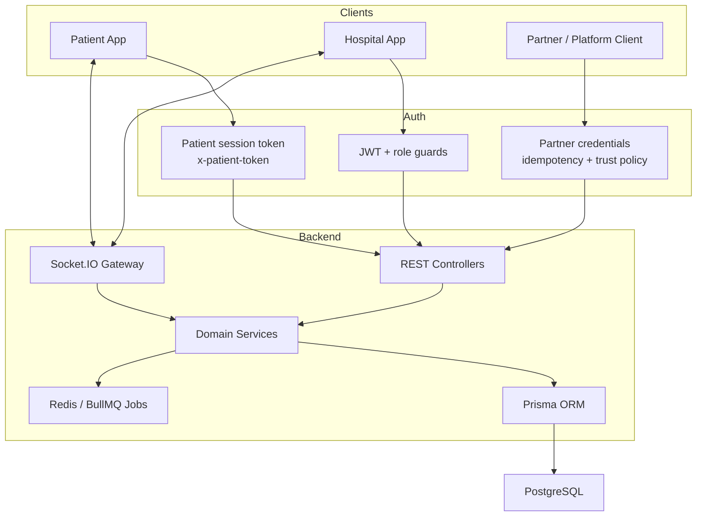

# Priage

`Version: 0.1 Alpha`

Priage is an emergency-department operations platform that lets patients notify a hospital before arrival, continue sharing updates while waiting, and gives staff a live encounter workspace from intake through treatment.

## Contents Summary

1. Problem Overview
2. Architecture Design / Technical Overview
3. Setup Instructions, Development Practices, Dependencies, Notes, and Useful Commands / Docs

## 1. Problem Overview

### Priage Mission

Priage exists to reduce the information gap between the moment a patient decides they need emergency care and the moment a clinician can meaningfully act on that information.

In a typical emergency workflow, important context is fragmented:

- patients often arrive with little structured information already captured
- staff may not see symptom progression until the patient is physically in front of them
- waiting-room communication is inconsistent or absent
- pre-arrival data, triage context, and live patient updates are rarely carried forward as one continuous operational record

Priage addresses that gap by treating the emergency visit as one connected encounter rather than a series of disconnected handoffs.

### What Priage 0.1 Alpha Does Today

At the current state of the codebase, Priage provides:

- a Patient App with guest check-in, patient sign-in, encounter status tracking, live messaging, and visit/profile updates
- a Hospital App with staff login, admit/admissions workflow, triage workflow, waiting-room monitoring, patient detail views, alerts, and messaging
- a NestJS backend that owns encounter lifecycle, patient and staff auth, intake, triage assessments, alerts, assets, messaging, real-time updates, structured logging, and a partner-facing platform intake layer
- a PostgreSQL data model centered around `PatientProfile`, `IntakeSession`, and `Encounter`

### Core Product Idea

Priage is trying to create a continuous emergency visit record that starts before the patient reaches the hospital and remains useful across:

- guest or authenticated intake
- hospital selection and encounter creation
- expected / en route state
- admitted / triage / waiting-room operations
- messaging and patient updates during the visit

## 2. Architecture Design / Technical Overview

### Priage Software Architecture



### API Layer And Connection Model



### Current System Shape

The codebase is not a static mockup anymore. It is a working multi-app stack with a shared operational model:

- `backend/` is the source of truth for auth, encounter state, triage, alerts, messaging, assets, logging, and partner intake
- `Apps/PatientApp/` is the patient-facing SPA
- `Apps/HospitalApp/` is the staff-facing SPA
- `docker-compose.yml` provides local PostgreSQL and Redis

### Boundary: First-party vs Partner APIs

Priage currently has two API surfaces inside the same NestJS backend:

- first-party controllers used by the Patient App and Hospital App
- partner-facing controllers under `/platform/v1` for external software integrations

That boundary is intentional:

- first-party patient/staff routes handle the normal Priage product experience
- partner routes handle software-to-software intake submission, context upload, asset upload, confirmation, cancellation, and status retrieval

The shared `IntakeSessionsModule` is internal workflow infrastructure reused by both surfaces. Partner-only concerns such as partner auth, scopes, idempotency, and trust-policy enforcement belong in `backend/src/modules/platform/*` and the related partner tables, not in first-party controller auth flows.

### Main Domain Model

The data model in `backend/prisma/schema.prisma` is centered on a few core records:

- `PatientProfile`: persistent patient identity and profile data
- `PatientSession`: patient-auth or guest session token state
- `IntakeSession`: draft/confirmed intake session state before and during confirmation
- `Encounter`: the operational visit record used by both apps
- `TriageAssessment`: clinical prioritization and triage detail
- `Message`: patient/staff communication tied to an encounter
- `Alert`: staff-visible operational or clinical escalation
- `Asset`: intake images and message attachments
- `ContextItem` and `SummaryProjection`: structured context and derived summaries for the platform layer


#### Patient App

Current patient-facing capabilities include:

- guest emergency check-in
- account sign-up and sign-in
- hospital routing for guest encounters
- en route / expected-state encounter view
- encounter workspace with status timeline, messaging, queue/status polling, and profile editing
- patient settings page
- a `Priage` patient page / AI-oriented surface in the current app shell

#### Hospital App

Current staff-facing capabilities include:

- JWT-based hospital staff login
- admit workflow for `EXPECTED` and `ADMITTED` encounters
- triage workflow and triage assessments
- waiting-room operations with patient detail modal and messaging
- derived alert handling and live update hooks
- analytics and settings pages are present in the app shell but are not the main operational surface today

### Backend Modules

The NestJS backend currently wires together these major modules:

- `auth`, `users`
- `patient-auth`
- `intake`, `intake-sessions`
- `encounters`
- `triage`
- `messaging`
- `alerts`
- `assets`
- `patients`, `hospitals`
- `realtime`, `redis`, `jobs`
- `logging`
- `priage`
- `platform`
- `health`

### Tech Stack

| Layer | Current stack |
|---|---|
| Patient App | React 18, React Router, Vite, TypeScript, Socket.IO client |
| Hospital App | React 18, Vite, TypeScript, Tailwind 4, Socket.IO client |
| Backend | NestJS 11, TypeScript, class-validator, Passport/JWT, Socket.IO |
| Data | PostgreSQL + Prisma |
| Realtime / Jobs | Redis, Socket.IO Redis adapter, BullMQ |
| Local infrastructure | Docker Compose |
| Auth modes | JWT for staff, patient session token for patients/guests, partner auth for platform |

## 3. Setup Instructions, Development Practices, Dependencies, Notes, and Useful Commands / Docs

### Setup Instructions

### External Software

- Node.js 20+
- npm 9+
- Docker Desktop
- Docker Compose v2

### Quick Start

From the repo root:

```bash
./priage-dev
```

Useful variants:

```bash
./priage-dev reseed
./priage-dev test
./priage-dev logs
./priage-dev logs -v
./priage-dev reseed test
./priage-dev -k
```

What the launcher does:

- verifies required local tools
- ensures PostgreSQL and Redis are up through Docker Compose
- runs `npm install` in `backend`, `Apps/PatientApp`, and `Apps/HospitalApp` only when `node_modules` is missing
- runs `npx prisma generate`
- runs `npx prisma migrate deploy`
- creates or reuses a private local admin in `.priage-dev/accounts.json`
- can optionally create an additional local hospital user in an existing hospital
- optionally clears patient-facing dev data and re-runs `backend/scripts/seed.js` against the bootstrap admin hospital
- opens the backend, Hospital App, and Patient App in separate macOS Terminal windows
- `./priage-dev -k` or `./priage-dev kill` stops those three managed dev services and closes their Terminal windows
- optionally runs the logging test suite when `logs` or `-l` is passed
- optionally runs the backend confidence pipeline after the API is reachable

### Manual Setup

#### 1. Clone and enter the repo

```bash
git clone <your-repo-url>
cd Priage
```

#### 2. Install dependencies

```bash
cd backend && npm install
cd ../Apps/PatientApp && npm install
cd ../HospitalApp && npm install
cd ../../
```

#### 3. Create local env files

```bash
cp backend/.env.example backend/.env
cp Apps/HospitalApp/.env.example Apps/HospitalApp/.env
cp Apps/PatientApp/.env.example Apps/PatientApp/.env
```

#### 4. Start local infrastructure

```bash
docker compose up -d
docker compose ps
```

#### 5. Generate Prisma client and apply committed migrations

```bash
cd backend
npx prisma generate
npx prisma migrate deploy
```

#### 6. Create a private local admin and seed demo data if needed

```bash
cd backend
node scripts/bootstrap-dev-accounts.js
TARGET_HOSPITAL_SLUG=<your-hospital-slug> node scripts/seed.js
```

#### 7. Start the apps manually

Backend:

```bash
cd backend
npm run start:dev
```

Hospital App:

```bash
cd Apps/HospitalApp
npm run dev
```

Patient App:

```bash
cd Apps/PatientApp
npm run dev
```

### Environment Notes

- backend default API port: `3000`
- Hospital App default Vite port: `5173`
- Patient App default Vite port: `5174` in the launcher flow
- backend local env is the important source for `DATABASE_URL`, `JWT_SECRET`, Redis host/port, and `APP_VERSION`

### Development Practices

### Prisma workflow

Use different Prisma commands for different jobs:

- startup / CI / local bootstrapping: `npx prisma migrate deploy`
- schema authoring during development: `npx prisma migrate dev --name <descriptive-name>`
- client generation: `npx prisma generate`

Do not use the launcher to author new migrations. The launcher is for applying already-committed migrations and starting the stack.

### Current workflow recommendation

When you pull new code:

```bash
./priage-dev
```

When you change `schema.prisma` intentionally:

```bash
cd backend
npx prisma migrate dev --name <describe-change>
npx prisma generate
```

When you want a fresh local patient/encounter dataset:

```bash
./priage-dev reseed
```

### Dependencies And Notes

### Key local dependencies

- PostgreSQL stores operational records
- Redis supports realtime and jobs infrastructure
- Prisma is the DB access layer
- Socket.IO powers realtime communication between backend and both SPAs

### Product notes for 0.1 Alpha

- the hospital operational core is Admit, Triage, and Waiting Room
- guest intake is a first-class patient flow
- patient/staff messaging is implemented and tied to encounters
- the backend already includes a partner/platform intake layer
- some non-core surfaces exist but are lighter-weight than the main encounter workflow

### Useful Commands

### Docker

```bash
docker compose up -d
docker compose ps
docker compose logs -f
docker compose down
docker compose down -v
```

### Backend

```bash
cd backend
npm run start:dev
npx prisma generate
npx prisma migrate deploy
npx prisma migrate dev --name <describe-change>
npx prisma studio
node scripts/seed.js
node scripts/reseed-dev.js
node scripts/bootstrap-dev-accounts.js
```

### Smoke And Platform Tests

```bash
cd backend
npm run test:smoke
npm run test:smoke:verbose
npm run test:platform
npm run test:logging
npm run test:logging:verbose
node scripts/e2e-frontend-flows.js --seed --verbose
```

### Frontend Builds

```bash
cd Apps/HospitalApp && npm run build
cd Apps/PatientApp && npm run build
```

### Useful Docs

- [SETUP.md](./SETUP.md) for local environment details and command reference
- [FEATURES.md](./FEATURES.md) for product / feature notes
- [backend/src/modules/logging/README.md](./backend/src/modules/logging/README.md) for logging-specific backend notes
- [backend/src/modules/logging/QUICKSTART.md](./backend/src/modules/logging/QUICKSTART.md) for logging queries and quick operational usage
