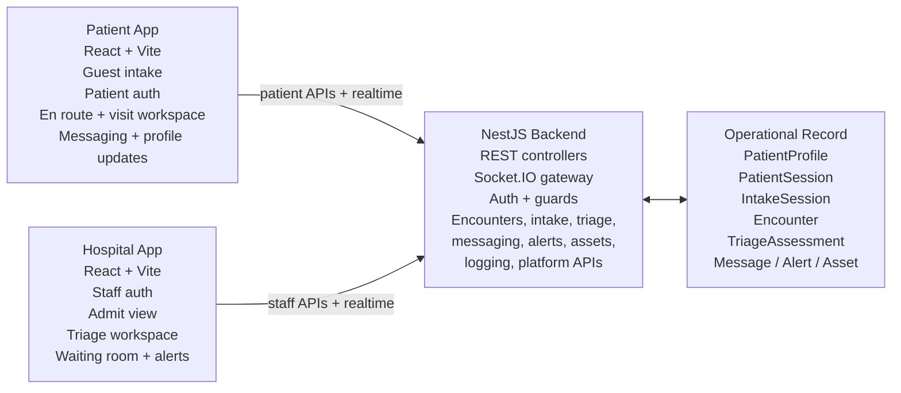
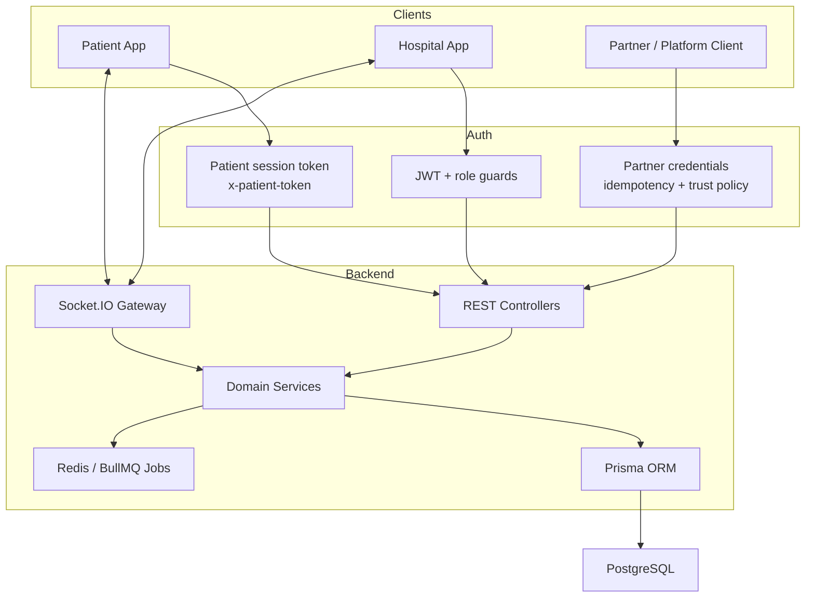

# Priage

`Version: 0.1 Alpha`

Priage is an emergency-department operations platform that lets patients notify a hospital before arrival, continue sharing updates while waiting, and gives staff a live encounter workspace from intake through treatment.

# OUTLINE:
**This is a comprehensive README, with both the value proposition for the competition, and the software architecture. For developers, scroll down to the development half of this document.**
1. Our Mission
2. Architecture Design / Technical Overview
3. Setup Instructions, Development Practices, Dependencies, Notes, and Useful Commands / Docs

---

## 1) Our Mission

**Our healthcare system is bursting at the seems: overloaded testing infrastructure, family doctor shortages, deep dissatisfaction, culminating to Canadians dying in the waiting room.**

**This is unacceptable.** Though, pointing fingers and shifting responsibility is not how we solve problems. Our healthcare system is riddled with inefficiency, neglect, and overworked staff—this is a deeply intrenched issue laden by conflicting interests, incentives and agendas. We want to challenge the system, and provide better ways to manage incoming traffic.

**1 in 7 of ~15 million visits to the ER could be managed by primary care. That’s 15% excess burden on Hospitals** who spent those resources, especially the time, on non-severe cases. That’s 2 million extra people where our hospitals could have been otherwise devoting their time to saving lives. Additionally, 1.2 million people leave the waiting room without being seen (in 2024). While many of those people could have be in a non-life-threatening emergency, others might leave prematurely; walk-outs may have a progressing condition, an oversight that could cost them their life.

Further, while research focus grows on prevention, **5.9 million Canadians lack a primary care provider**. Individuals who may have high-risk profiles cannot access the support they need. Symptoms that may be indicative of late stage disease (such as cancer, coronary artery disease, and even diabetes) can be passed off as insignificant. While the majority of Canadians do have access to the primary care network, there is consensus that Canadians are unsatisfied. Long wait times, unaccommodating services, and poor understanding of their condition. Many Canadians seek help, and understanding, though they are left concerned and conflicted about their health. 

**It is clear that this is a social, and systemic problem. We allow the slow-adapting public system to fall further behind immediate, modern needs. It is time that we force against this inertia towards a healthcare system that works with patients, and enables hospitals to provide more care with less.**

### Presenting Priage 

Priage is our platform to address the patient traffic and support for Hospitals. We want to build the infrastructure for managing patients before treatment: from starting their encounters from their phones, wherever they are. Priage is intent to create better access to information where previously overlooked. 

Our core value proposition:
#### 1) Priage. To manage patient traffic, and identify where patients need and can go to for treatment

We are prioritizing true emergencies, to reduce unnecessary burden on the care network. We are evaluating severity before triage: Pre-Triage.

Some patients are simply concerned about their health, and are not educated about medicine. They do not understand how to recognize potential life-threatening signs or symptoms. A purple spot under the skins could be a simple bruise. It could also be internal bleeding. It could very well be flesh-eating bacteria. This is an education problem. We need to be able to make fast decisions, and give the understanding to patients that quell their fears.

**Priage will leverage performant AI Vision models**, which are capable of recognizing pathological features to 99% accuracy, crushing human performance in few-shot analysis. Priage in fact, it solving an easier problem. We are not trying to replace doctors or triage staff: we are trying to help make the decisions for patients on whether they should go to the emergency room. It is a layer where we can accelerate patient inflow for those who need it, and course-correction for cases better solved by primary care, or clinics other than the emergency room.  

Thus, we also will manage the routing to the alternative treatment resources. With a network of hospitals and clinics, we can access live wait times and patient load data, which is currently inaccessible at scale without partnerships. We can reallocate concerned patients who do not have emergency cases to treatment resources with better fit. 

#### 2) To support hospitals by accelerating patient processing

For hospital to provider more and easier, we want to enable the most efficient transfer of information. By helping hospitals, we help patients get the care they need.

**We will not allow for anyone to die in the waiting room.** We want to supercharge hospital staff by allowing for live monitoring of any patient in their waiting room, through their personal devices. Everyone has phones, this is no secret. Approximately 95% of Canadian adults own a smartphone as of 2025, with ownership being near-universal across most age demographics. Data from early 2025 shows 41.6 million active cellular mobile connections in Canada, equivalent to 104% of the total population, indicating that many people own more than one device or have multiple plans. 

Patients should be able to interface with their waiting room staff: To send requests if they have any problems, or especially progressing symptoms. Care providers should also be able to interface with their patients, so that they can be aware of any potential high-risk cases. Priage as a platform enables this line of communication, where patients can communicate with their providers directly. 

Waiting Room staff can view a dashboard of all the patients in the waiting room, where they can access necessary information about the patient. We may also enable remote waiting rooms, so that pathogens can’t spread in crowded rooms. To reduce the overhead, we leverage LLMs and hard-coded software to summarize and prioritize messages, so that if a severe alert is hidden amongst dozens of patients, it is ensured to reach the care team. 

We also want to give patients care-provider approved readings, summaries of their treatment, and information about concerns during their encounter and after they are seen by medical staff. We can provide that satisfaction of knowing you are not in danger by answering questions and detailed explanations to patients as they leave the hospital. By taking the burden of lossy explanations from the medical staff, patients don’t receive over-simplified reasons for their symptoms.

---

# Development 

## Architecture:
We are building a modular platform for Hospitals, Clinics and Patients. We want to build a prototype to present to Hospitals, and so we need to build the basic architecture which will be the foundation for scaling in the future. We are going to build the following:


## 2. Architecture Design / Technical Overview

### Priage Software Architecture



### API Layer And Connection Model



### Current System Shape

The codebase is not a static mockup anymore. It is a working multi-app stack with a shared operational model:

- `backend/` is the source of truth for auth, encounter state, triage, alerts, messaging, assets, logging, and partner intake
- `Apps/PatientApp/` is the patient-facing SPA
- `Apps/HospitalApp/` is the staff-facing SPA
- `docker-compose.yml` provides local PostgreSQL and Redis

### Boundary: First-party vs Partner APIs

Priage currently has two API surfaces inside the same NestJS backend:

- first-party controllers used by the Patient App and Hospital App
- partner-facing controllers under `/platform/v1` for external software integrations

That boundary is intentional:

- first-party patient/staff routes handle the normal Priage product experience
- partner routes handle software-to-software intake submission, context upload, asset upload, confirmation, cancellation, and status retrieval

The shared `IntakeSessionsModule` is internal workflow infrastructure reused by both surfaces. Partner-only concerns such as partner auth, scopes, idempotency, and trust-policy enforcement belong in `backend/src/modules/platform/*` and the related partner tables, not in first-party controller auth flows.

### Main Domain Model

The data model in `backend/prisma/schema.prisma` is centered on a few core records:

- `PatientProfile`: persistent patient identity and profile data
- `PatientSession`: patient-auth or guest session token state
- `IntakeSession`: draft/confirmed intake session state before and during confirmation
- `Encounter`: the operational visit record used by both apps
- `TriageAssessment`: clinical prioritization and triage detail
- `Message`: patient/staff communication tied to an encounter
- `Alert`: staff-visible operational or clinical escalation
- `Asset`: intake images and message attachments
- `ContextItem` and `SummaryProjection`: structured context and derived summaries for the platform layer


#### Patient App

Current patient-facing capabilities include:

- guest emergency check-in
- account sign-up and sign-in
- hospital routing for guest encounters
- en route / expected-state encounter view
- encounter workspace with status timeline, messaging, queue/status polling, and profile editing
- patient settings page
- a `Priage` patient page / AI-oriented surface in the current app shell

#### Hospital App

Current staff-facing capabilities include:

- JWT-based hospital staff login
- admit workflow for `EXPECTED` and `ADMITTED` encounters
- triage workflow and triage assessments
- waiting-room operations with patient detail modal and messaging
- derived alert handling and live update hooks
- analytics and settings pages are present in the app shell but are not the main operational surface today

### Backend Modules

The NestJS backend currently wires together these major modules:

- `auth`, `users`
- `patient-auth`
- `intake`, `intake-sessions`
- `encounters`
- `triage`
- `messaging`
- `alerts`
- `assets`
- `patients`, `hospitals`
- `realtime`, `redis`, `jobs`
- `logging`
- `priage`
- `platform`
- `health`

### Tech Stack

| Layer | Current stack |
|---|---|
| Patient App | React 18, React Router, Vite, TypeScript, Socket.IO client |
| Hospital App | React 18, Vite, TypeScript, Tailwind 4, Socket.IO client |
| Backend | NestJS 11, TypeScript, class-validator, Passport/JWT, Socket.IO |
| Data | PostgreSQL + Prisma |
| Realtime / Jobs | Redis, Socket.IO Redis adapter, BullMQ |
| Local infrastructure | Docker Compose |
| Auth modes | JWT for staff, patient session token for patients/guests, partner auth for platform |

## 3. Setup Instructions, Development Practices, Dependencies, Notes, and Useful Commands / Docs

### Setup Instructions

### External Software

- Node.js 20+
- npm 9+
- Docker Desktop
- Docker Compose v2

### Quick Start

From the repo root:

```bash
./priage-dev
```

Useful variants:

```bash
./priage-dev newuser
./priage-dev reseed
./priage-dev fullseed
./priage-dev test
./priage-dev logs
./priage-dev logs -v
./priage-dev reseed test
./priage-dev fullseed test
./priage-dev -k
```

What the launcher does:

- verifies required local tools
- ensures PostgreSQL and Redis are up through Docker Compose
- creates missing `backend/.env`, `Apps/HospitalApp/.env`, and `Apps/PatientApp/.env` from their checked-in `.env.example` files
- runs `npm install` in `backend`, `Apps/PatientApp`, and `Apps/HospitalApp` only when `node_modules` is missing
- runs `npx prisma generate`
- runs `npx prisma migrate deploy`
- creates or reuses a private local admin in `.priage-dev/accounts.json`
- can optionally create an additional local hospital user in an existing hospital when `newuser` or `-u` is passed
- optionally clears patient-facing dev data and re-runs either `backend/scripts/seed.js` (`reseed`) or the richer `backend/scripts/demo-seed.js` (`fullseed`) against the bootstrap admin hospital
- opens the backend, Hospital App, and Patient App in separate macOS Terminal windows
- `./priage-dev -k` or `./priage-dev kill` stops those three managed dev services and closes their Terminal windows
- optionally runs the logging test suite when `logs` or `-l` is passed
- optionally runs the backend confidence pipeline after the API is reachable

### Manual Setup

#### 1. Clone and enter the repo

```bash
git clone <your-repo-url>
cd Priage
```

#### 2. Install dependencies

```bash
cd backend && npm install
cd ../Apps/PatientApp && npm install
cd ../HospitalApp && npm install
cd ../../
```

#### 3. Create local env files

```bash
cp backend/.env.example backend/.env
cp Apps/HospitalApp/.env.example Apps/HospitalApp/.env
cp Apps/PatientApp/.env.example Apps/PatientApp/.env
```

#### 4. Start local infrastructure

```bash
docker compose up -d
docker compose ps
```

#### 5. Generate Prisma client and apply committed migrations

```bash
cd backend
npx prisma generate
npx prisma migrate deploy
```

#### 6. Create a private local admin and seed demo data if needed

```bash
cd backend
node scripts/bootstrap-dev-accounts.js
TARGET_HOSPITAL_SLUG=<your-hospital-slug> node scripts/seed.js
```

#### 7. Start the apps manually

Backend:

```bash
cd backend
npm run start:dev
```

Hospital App:

```bash
cd Apps/HospitalApp
npm run dev
```

Patient App:

```bash
cd Apps/PatientApp
npm run dev
```

### Environment Notes

- backend default API port: `3000`
- Hospital App default Vite port: `5173`
- Patient App default Vite port: `5174` in the launcher flow
- backend local env is the important source for `DATABASE_URL`, `JWT_SECRET`, Redis host/port, and `APP_VERSION`

### Development Practices

### Prisma workflow

Use different Prisma commands for different jobs:

- startup / CI / local bootstrapping: `npx prisma migrate deploy`
- schema authoring during development: `npx prisma migrate dev --name <descriptive-name>`
- client generation: `npx prisma generate`

Do not use the launcher to author new migrations. The launcher is for applying already-committed migrations and starting the stack.

### Current workflow recommendation

When you pull new code:

```bash
./priage-dev
```

When you change `schema.prisma` intentionally:

```bash
cd backend
npx prisma migrate dev --name <describe-change>
npx prisma generate
```

When you want a fresh local patient/encounter dataset:

```bash
./priage-dev reseed
```

When you want a heavier, more realistic waiting room/admit/triage dataset:

```bash
./priage-dev fullseed
```

### Dependencies And Notes

### Key local dependencies

- PostgreSQL stores operational records
- Redis supports realtime and jobs infrastructure
- Prisma is the DB access layer
- Socket.IO powers realtime communication between backend and both SPAs

### Product notes for 0.1 Alpha

- the hospital operational core is Admit, Triage, and Waiting Room
- guest intake is a first-class patient flow
- patient/staff messaging is implemented and tied to encounters
- the backend already includes a partner/platform intake layer
- some non-core surfaces exist but are lighter-weight than the main encounter workflow

### Useful Commands

### Docker

```bash
docker compose up -d
docker compose ps
docker compose logs -f
docker compose down
docker compose down -v
```

### Backend

```bash
cd backend
npm run start:dev
npx prisma generate
npx prisma migrate deploy
npx prisma migrate dev --name <describe-change>
npx prisma studio
node scripts/seed.js
node scripts/reseed-dev.js
node scripts/bootstrap-dev-accounts.js
```

### Smoke And Platform Tests

```bash
cd backend
npm run test:smoke
npm run test:smoke:verbose
npm run test:platform
npm run test:logging
npm run test:logging:verbose
node scripts/e2e-frontend-flows.js --seed --verbose
```

### Frontend Builds

```bash
cd Apps/HospitalApp && npm run build
cd Apps/PatientApp && npm run build
```

### Useful Docs

- [SETUP.md](./SETUP.md) for local environment details and command reference
- [FEATURES.md](./FEATURES.md) for product / feature notes
- [backend/src/modules/logging/README.md](./backend/src/modules/logging/README.md) for logging-specific backend notes
- [backend/src/modules/logging/QUICKSTART.md](./backend/src/modules/logging/QUICKSTART.md) for logging queries and quick operational usage
