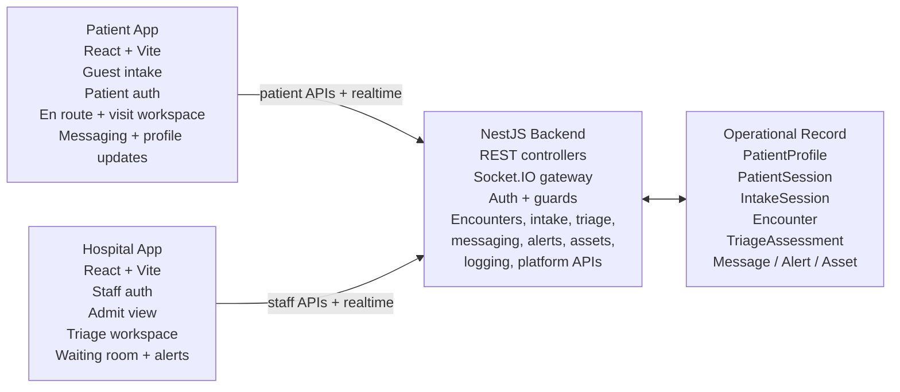
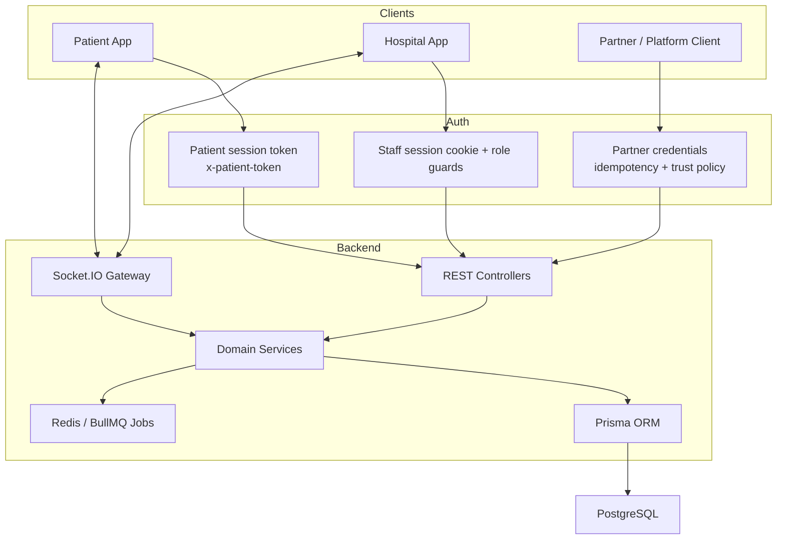

# Priage

`Version: 0.1 Alpha`

Priage is a web-based patient intake and encounter platform. The existing emergency-department flow supports intake, triage, waiting-room operations, and messaging. A gated local clinic preview now supports intake and appointment requests; email and the physician Care workspace remain to be built. The pilot scope is in [the clinic plan](./docs/CLINIC_PILOT_PLAN.md) and [implementation blueprint](./docs/CLINIC_PILOT_IMPLEMENTATION_BLUEPRINT.md).

# OUTLINE:
This README summarizes the product and current architecture. The [clinic pilot plan](./docs/CLINIC_PILOT_PLAN.md) is the working scope for the next release.
1. Our Mission
2. Architecture Design / Technical Overview
3. Setup Instructions, Development Practices, Dependencies, Notes, and Useful Commands / Docs

---

## 1) Our Mission

Priage aims to help a care team understand a patient's complaint before the visit, carry that context through reception and care, and keep the patient informed. The encounter is the shared record of that journey. Patients can report their history and changes; clinicians review the source answers and assessment before using them in care.

The current software supports emergency-department-style intake, triage, waiting-room monitoring, and messaging. The proposed clinic pilot focuses on appointment requests, receptionist confirmation, a physician Care view, and email reminders. See the [feature inventory](./FEATURES.md) for implemented behavior and the [pilot plan](./docs/CLINIC_PILOT_PLAN.md) for the target workflow and release gaps.

AI-generated content is decision support and needs clinician review. The [clinical governance policy](./docs/CLINICAL_GOVERNANCE.md) describes safety and release requirements. Priage does not claim to diagnose, assign final triage priority, or guarantee outcomes.

---

# Development

## Architecture:
We are building a modular platform for Hospitals, Clinics and Patients. We want to build a prototype to present to Hospitals, and so we need to build the basic architecture which will be the foundation for scaling in the future. We are going to build the following:


## 2. Architecture Design / Technical Overview

### Priage Software Architecture


```mermaid
flowchart LR
    patient["Patient App<br/>React + Vite<br/>Guest intake<br/>Patient auth<br/>En route + visit workspace<br/>Messaging + profile updates"]
    hospital["Hospital App<br/>React + Vite<br/>Staff auth<br/>Admit view<br/>Triage workspace<br/>Waiting room + alerts"]
    backend["NestJS Backend<br/>REST controllers<br/>Socket.IO gateway<br/>Auth + guards<br/>Encounters, intake, triage,<br/>messaging, alerts, assets,<br/>logging, platform APIs"]
    data["Operational Record<br/>PatientProfile<br/>PatientSession<br/>IntakeSession<br/>Encounter<br/>TriageAssessment<br/>Message / Alert / Asset"]

    patient -->|"patient APIs + realtime"| backend
    hospital -->|"staff APIs + realtime"| backend
    backend <--> data
```

### API Layer And Connection Model


```mermaid
flowchart TB
    subgraph Clients
      patient["Patient App"]
      hospital["Hospital App"]
      partner["Partner / Platform Client"]
    end

    subgraph Auth
      patientAuth["Patient session token<br/>x-patient-token"]
      staffAuth["Staff session cookie + role guards"]
      partnerAuth["Partner credentials<br/>idempotency + trust policy"]
    end

    subgraph Backend
      rest["REST Controllers"]
      socket["Socket.IO Gateway"]
      services["Domain Services"]
      jobs["Redis / BullMQ Jobs"]
      prisma["Prisma ORM"]
    end

    db["PostgreSQL"]

    patient --> patientAuth --> rest
    hospital --> staffAuth --> rest
    partner --> partnerAuth --> rest

    patient <--> socket
    hospital <--> socket

    rest --> services
    services --> prisma --> db
    services --> jobs
    socket --> services
```

### Current System Shape

The codebase is not a static mockup anymore. It is a working multi-app stack with a shared operational model:

- `backend/` is the source of truth for auth, encounter state, triage, alerts, messaging, assets, logging, and partner intake
- `Apps/PatientApp/` is the patient-facing SPA
- `Apps/HospitalApp/` is the staff-facing SPA
- `docker-compose.yml` provides local PostgreSQL and Redis

### Boundary: First-party vs Partner APIs

Priage currently has two API surfaces inside the same NestJS backend:

- first-party controllers used by the Patient App and Hospital App
- partner-facing controllers under `/platform/v1` for external software integrations

That boundary is intentional:

- first-party patient/staff routes handle the normal Priage product experience
- partner routes handle software-to-software intake submission, context upload, asset upload, confirmation, cancellation, and status retrieval

The shared `IntakeSessionsModule` is internal workflow infrastructure reused by both surfaces. Partner-only concerns such as partner auth, scopes, idempotency, and trust-policy enforcement belong in `backend/src/modules/platform/*` and the related partner tables, not in first-party controller auth flows.

### Main Domain Model

The data model in `backend/prisma/schema.prisma` is centered on a few core records:

- `PatientProfile`: persistent patient identity and profile data
- `PatientSession`: patient-auth or guest session token state
- `IntakeSession`: draft/confirmed intake session state before and during confirmation
- `Encounter`: the operational visit record used by both apps
- `TriageAssessment`: clinical prioritization and triage detail
- `Message`: patient/staff communication tied to an encounter
- `Alert`: staff-visible operational or clinical escalation
- `Asset`: intake images and message attachments
- `ContextItem` and `SummaryProjection`: structured context and derived summaries for the platform layer


#### Patient App

Current patient-facing capabilities include:

- guest emergency check-in
- account sign-up and sign-in
- hospital routing for guest encounters
- en route / expected-state encounter view
- encounter workspace with status timeline, messaging, queue/status polling, and profile editing
- patient settings page
- an AI interview with persisted question/answer history and summary before hospital selection

#### Hospital App

Current staff-facing capabilities include:

- cookie-backed staff sessions with optional TOTP MFA and device binding
- admit workflow for `EXPECTED` and `ADMITTED` encounters
- triage workflow and triage assessments
- waiting-room operations with patient detail modal and messaging
- derived alert handling and live update hooks
- analytics and settings pages are present in the app shell but are not the main operational surface today

### Backend Modules

The NestJS backend currently wires together these major modules:

- `auth`, `users`
- `patient-auth`
- `intake`, `intake-sessions`
- `encounters`
- `triage`
- `messaging`
- `alerts`
- `assets`
- `patients`, `hospitals`
- `realtime`, `redis`, `jobs`
- `logging`
- `priage`
- `platform`
- `health`

### Tech Stack

| Layer | Current stack |
|---|---|
| Patient App | React 18, React Router, Vite, TypeScript, Socket.IO client |
| Hospital App | React 18, Vite, TypeScript, Tailwind 4, Socket.IO client |
| Backend | NestJS 11, TypeScript, class-validator, Passport/JWT, Socket.IO |
| Data | PostgreSQL + Prisma |
| Realtime / Jobs | Redis, Socket.IO Redis adapter, BullMQ |
| Local infrastructure | Docker Compose |
| Auth modes | Cookie-backed staff sessions and role guards, patient session token/cookie for patients and guests, partner auth for platform |

## 3. Setup Instructions, Development Practices, Dependencies, Notes, and Useful Commands / Docs

### Setup Instructions

### External Software

- Node.js 20+
- npm 9+
- Docker Desktop
- Docker Compose v2

### Quick Start

From the repo root:

```bash
./priage-dev
```

Useful variants:

```bash
./priage-dev newuser
./priage-dev reseed
./priage-dev fullseed
./priage-dev test
./priage-dev logs
./priage-dev logs -v
./priage-dev reseed test
./priage-dev fullseed test
./priage-dev -k
./priage-dev -t clinic
./priage-dev --instance clinic-1 test
./priage-dev --instance clinic-1 -k
./priage-dev -all
./priage-dev -all fullseed
./priage-dev -all -k
```

Plain `./priage-dev` starts or reuses the ED instance, `ed-1`. `-t clinic` prompts for a clinic name, address, phone, timezone, check-in instructions and whether it accepts walk-ins, then creates a **new** clinic instance with its own workflow and local database. Repeating it creates another instance; if the name is already used, the internal slug receives a numeric suffix. Use `--instance NAME` to start, seed, test or stop an existing one. `-all` applies the remaining flags sequentially to every registered instance; `-all -k` stops all of them. Without a selector, `-k` still stops only the most recently started running instance. The old `-t` test shorthand is now `-T` (`test` still works).

Each named instance has its own PostgreSQL and Redis containers, database volume, backend, clinic/staff app, patient app, account manifest, and browser auth cookies. `ed-1` keeps ports 5432/6379/3000/5173/5174 and its existing Compose containers. The first additional tenant uses 5433/6380/3001/5175/5176. Later tenants get the next available port set; the assigned ports and clinic details persist in `.priage-dev/registry.json`. The hospital uses the entered clinic name and information; its unique internal slug identifies the isolated instance. `clinic-*` instances start the pinned clinic preview with local mock weekday hours and clearly marked mock Terms and Privacy text. They are for local testing only. These separate local databases do not change the planned shared, hospital-scoped PostgreSQL database in Azure.

What the launcher does:

- verifies required local tools
- ensures PostgreSQL and Redis are up through Docker Compose
- creates missing `backend/.env`, `Apps/HospitalApp/.env`, and `Apps/PatientApp/.env` from their checked-in `.env.example` files
- runs `npm install` in `backend`, `Apps/PatientApp`, and `Apps/HospitalApp` only when `node_modules` is missing
- runs `npx prisma generate`
- runs `npx prisma migrate deploy`
- creates or reuses a private local admin in `.priage-dev/accounts.json` for `ed-1`, or `.priage-dev/tenants/<name>/accounts.json` for another tenant
- can optionally create an additional local hospital user in an existing hospital when `newuser` or `-u` is passed
- optionally clears patient-facing dev data; ED runs ED seed scripts, while clinic `fullseed` creates mock intake, appointment and permitted walk-in visits through the clinic API
- opens the backend, Hospital App, and Patient App in separate macOS Terminal windows
- `./priage-dev -k` or `./priage-dev kill` stops only the selected instance's managed processes and containers, retaining its database volume
- optionally runs the logging test suite when `logs` or `-l` is passed
- optionally runs the backend confidence pipeline after the API is reachable

### Manual Setup

#### 1. Clone and enter the repo

```bash
git clone <your-repo-url>
cd Priage
```

#### 2. Install dependencies

```bash
cd backend && npm install
cd ../Apps/PatientApp && npm install
cd ../HospitalApp && npm install
cd ../../
```

#### 3. Create local env files

```bash
cp backend/.env.example backend/.env
cp Apps/HospitalApp/.env.example Apps/HospitalApp/.env
cp Apps/PatientApp/.env.example Apps/PatientApp/.env
```

#### 4. Start local infrastructure

```bash
docker compose up -d
docker compose ps
```

#### 5. Generate Prisma client and apply committed migrations

```bash
cd backend
npx prisma generate
npx prisma migrate deploy
```

#### 6. Create a private local admin and seed demo data if needed

```bash
cd backend
node scripts/bootstrap-dev-accounts.js
TARGET_HOSPITAL_SLUG=<your-hospital-slug> node scripts/seed.js
```

#### 7. Start the apps manually

Backend:

```bash
cd backend
npm run start:dev
```

Hospital App:

```bash
cd Apps/HospitalApp
npm run dev
```

Patient App:

```bash
cd Apps/PatientApp
npm run dev
```

### Environment Notes

- backend default API port: `3000`
- Hospital App default Vite port: `5173`
- Patient App default Vite port: `5174` in the launcher flow
- backend local env is the important source for `DATABASE_URL`, `JWT_SECRET`, Redis host/port, and `APP_VERSION`

### Development Practices

### Prisma workflow

Use different Prisma commands for different jobs:

- startup / CI / local bootstrapping: `npx prisma migrate deploy`
- schema authoring during development: `npx prisma migrate dev --name <descriptive-name>`
- client generation: `npx prisma generate`

Do not use the launcher to author new migrations. The launcher is for applying already-committed migrations and starting the stack.

### Current workflow recommendation

When you pull new code:

```bash
./priage-dev
```

When you change `schema.prisma` intentionally:

```bash
cd backend
npx prisma migrate dev --name <describe-change>
npx prisma generate
```

When you want a fresh local patient/encounter dataset:

```bash
./priage-dev reseed
```

When you want a heavier, more realistic waiting room/admit/triage dataset:

```bash
./priage-dev fullseed
```

### Dependencies And Notes

### Key local dependencies

- PostgreSQL stores operational records
- Redis supports realtime and jobs infrastructure
- Prisma is the DB access layer
- Socket.IO powers realtime communication between backend and both SPAs

### Product notes for 0.1 Alpha

- the hospital operational core is Admit, Triage, and Waiting Room
- guest intake is a first-class patient flow
- patient/staff messaging is implemented and tied to encounters
- the backend already includes a partner/platform intake layer
- clinic appointment booking, email reminders, the Reception/Care pilot flow, and physician notes remain planned work
- [the clinic pilot plan](./docs/CLINIC_PILOT_PLAN.md) separates current code from the target workflow and its delivery order

### Useful Commands

### Docker

```bash
docker compose up -d
docker compose ps
docker compose logs -f
docker compose down
docker compose down -v
```

### Backend

```bash
cd backend
npm run start:dev
npx prisma generate
npx prisma migrate deploy
npx prisma migrate dev --name <describe-change>
npx prisma studio
node scripts/seed.js
node scripts/reseed-dev.js
node scripts/bootstrap-dev-accounts.js
```

### Smoke And Platform Tests

```bash
cd backend
npm run test:smoke
npm run test:smoke:verbose
npm run test:platform
npm run test:logging
npm run test:logging:verbose
node scripts/e2e-frontend-flows.js --seed --verbose
```

### Frontend Builds

```bash
cd Apps/HospitalApp && npm run build
cd Apps/PatientApp && npm run build
```

### Useful Docs

- [SETUP.md](./SETUP.md) for local environment details and command reference
- [FEATURES.md](./FEATURES.md) for the audited feature inventory
- [docs/CLINIC_PILOT_PLAN.md](./docs/CLINIC_PILOT_PLAN.md) for clinic pilot scope, gaps, priorities, and acceptance tests
- [docs/AI_ASSESSMENT_VISION.md](./docs/AI_ASSESSMENT_VISION.md) and [docs/AI_ASSESSMENT_HARNESS.md](./docs/AI_ASSESSMENT_HARNESS.md) for what the assessment model is for and how its harness works
- [backend/src/modules/logging/README.md](./backend/src/modules/logging/README.md) for logging-specific backend notes
- [backend/src/modules/logging/QUICKSTART.md](./backend/src/modules/logging/QUICKSTART.md) for logging queries and quick operational usage
