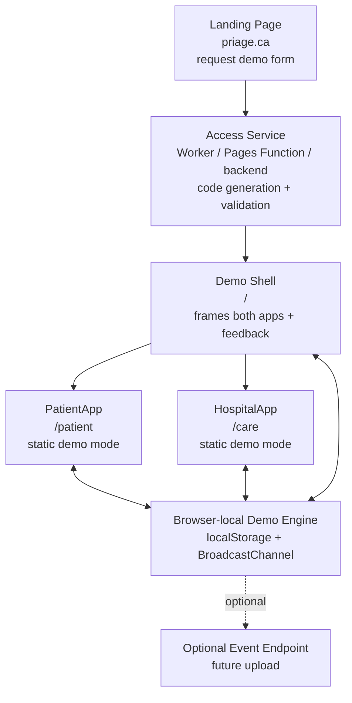

# Priage Demo Experience Handoff

This document is both a product/experience brief and a technical handoff for the Priage demo system. It should help a future Codex session understand what the demo is supposed to become, what currently exists, where the current implementation lives, and how to continue without flattening the vision into a simple static mockup.

The most important framing is this:

The Priage demo is a controlled sales and feedback experience. The current implementation is a static/browser-local runtime because that is the safest, cheapest, and fastest first version. "Static" describes the current runtime. It does not describe the full product expectation.

## 1. Product Goal

The demo exists to let prospective hospitals, clinics, advisors, partners, and investors experience Priage safely before there is a full production deployment or integration. It should demonstrate the value of Priage from both sides of the workflow:

- The patient can start an encounter before arrival, provide intake information, follow care status, and communicate updates.
- The hospital team can see that patient enter the operational queue, review intake context, move the encounter through workflow states, triage, message the patient, and understand waiting-room/analytics value.

The demo should feel like a productized sales environment, not a development sandbox. It should be polished enough to support prospecting, pitch meetings, early product validation, and structured feedback collection.

The demo has four primary goals:

1. Let prospects experience both applications together.
2. Present Priage through a guided, high-quality product showcase.
3. Collect sales and product intelligence.
4. Gate access through a generated demo code or secure demo link.

## 2. Experience Expectations

The target demo experience is a funnel, not only an app route.

Expected end-to-end flow:

1. A prospect visits the public landing page, for example `priage.ca`.
2. The landing page explains the Priage mission, target users, workflow, and value proposition.
3. The prospect requests demo access by submitting a form with email, name, organization, role, organization type, and areas of interest.
4. A small access service validates the request, applies abuse protection, generates a demo code or signed link, stores the request, and emails the prospect.
5. The prospect opens the demo surface, for example `demo.priage.ca`.
6. The prospect enters email plus code or follows a signed link.
7. The access service validates the code server-side and sets a short-lived authorized demo session.
8. The demo shell loads the PatientApp and HospitalApp in demo mode.
9. The prospect chooses guided tour, free explore, patient-only fullscreen, or hospital-only fullscreen.
10. The demo records local and/or uploaded telemetry tied to an opaque demo session id.
11. The prospect submits feedback, requests a callback, or schedules a full demo.

The current branch implements the browser-local app runtime for steps 8-10. It does not yet implement the landing page, generated code service, email delivery, secure access gate, polished guided showcase, or production event collection.

## 3. Demo Instance Model

Use the phrase "generated demo instance" carefully.

In the current lightweight architecture, a generated demo instance means:

- The prospect has passed a real access gate outside the static app.
- The static demo app receives opaque metadata such as `demoCode` or `demoSessionId`.
- The browser creates an isolated local scenario using seeded fictional data.
- The scenario runs in the prospect's browser using static assets, `localStorage`, deterministic demo actions, and `BroadcastChannel` frame sync.

This is intentionally not a real backend tenant. It avoids exposing:

- production APIs
- databases
- AI provider keys
- staff credentials
- real patient data
- live hospital integrations
- server compute for each prospect

A later architecture may create true server-backed demo instances with an edge database, Durable Object, lightweight backend, or per-prospect remote session. That would enable cross-device sync, persistent telemetry, collaborative demos, server-side recovery, and richer sales analytics. Treat that as a future extension, not as the requirement for the current static demo runtime.

## 4. Access Control Expectations

The static frontend must not be trusted for real access control. A static app can hide UI, but it cannot securely protect its source bundle or enforce authorization by itself.

Real access control must happen before or during asset serving through one of these:

- Cloudflare Worker
- Cloudflare Pages Function
- Cloudflare Access
- landing-page backend
- signed URL
- signed, HttpOnly cookie

The generated demo code flow should eventually:

1. Generate a random demo code or signed link.
2. Store only a hashed code server-side.
3. Bind the code to an email or opaque request record.
4. Apply expiry and redemption limits.
5. Validate the code server-side.
6. Set a secure, HttpOnly demo session cookie.
7. Allow demo shell and app routes only while the session is valid.
8. Record request, verification, opening, conversion, and callback events.

The static demo may receive `demoCode` or `demoSessionId` as opaque metadata, but it must not contain secrets or make trusted authorization decisions.

## 5. Deployment Shape

Intended public structure:

- `priage.ca`: marketing landing page and demo request form
- `demo.priage.ca`: code entry, validation, and demo shell
- `/patient` or `patient.priage.ca`: patient demo surface
- `/care` or `care.priage.ca`: care-team demo surface

The current implementation assumes the shell, patient app, and hospital app are served under the same origin:

- `/`
- `/patient/`
- `/care/`

Same-origin hosting matters because the current runtime syncs both apps through browser-local state and `BroadcastChannel`. If patient and hospital are moved to separate subdomains, one of these must happen:

- accept independent unsynchronized demos, or
- introduce a small shared backend/session layer, or
- use a hosting strategy that preserves same-origin frame access for the shell and apps.

For the current Cloudflare Pages target, prefer one same-origin static deployment with `/demo`, `/patient`, and `/care` paths.

## 6. Current Implementation Status

The branch currently has a static-only demo foundation that can be built into `dist/static-demo`.

Working today:

- Demo shell renders PatientApp and HospitalApp together.
- Desktop shows both apps side by side.
- Mobile/narrow layouts can switch visible app panels.
- PatientApp runs guest intake in static mode.
- PatientApp can complete deterministic interview steps.
- PatientApp can select `Priage Demo Hospital`.
- PatientApp can create a browser-local encounter.
- HospitalApp starts as a fixed demo admin user.
- HospitalApp receives patient-created encounters through local shared state.
- HospitalApp can read local encounters, triage, messaging, config, and analytics data.
- Shared state syncs across frames through `BroadcastChannel`.
- Reset restores seeded state and clears local patient/hospital session/draft keys.
- Feedback is stored locally and logged as a demo event.
- Static build output includes Cloudflare-style redirects.

Verified smoke result from the current branch:

- Loaded the shell with no backend running.
- Completed a fictional patient guest check-in.
- Chose `Priage Demo Hospital`.
- Notified the hospital.
- Confirmed `Taylor Demo` appeared in HospitalApp admittance.
- Submitted local feedback and saw the success message.

Not built yet:

- landing page
- generated-code request/verify flow
- email sending
- secure edge access gate
- polished multi-app showcase/tour
- production telemetry upload
- callback scheduling
- cross-device demo synchronization
- server-backed demo instance

## 7. High-Level Architecture

The current demo runtime has three layers:

1. Demo shell
2. Shared static demo engine
3. App static transport/runtime seams

Future landing-page/access infrastructure should sit in front of these layers, not inside them.



## 8. Demo Shell

Location:

- `Apps/DemoShell/index.html`
- `Apps/DemoShell/src/main.ts`
- `Apps/DemoShell/src/styles.css`
- `Apps/DemoShell/vite.config.ts`

Purpose:

The shell is the deployable demo entrypoint. It frames the experience, loads both apps, displays simple session metadata, collects feedback, and owns reset/view controls.

Current responsibilities:

- Render demo header and session context.
- Read opaque query metadata such as `demoCode` and `demoSessionId`.
- Load PatientApp under `/patient/?demo=static`.
- Load HospitalApp under `/care/?demo=static`.
- Provide view toggles: both, patient, hospital.
- Provide links to open patient/hospital fullscreen.
- Reset the local scenario.
- Capture feedback locally.
- Display simple metrics such as encounter count and event count.

Expected future responsibilities:

- Offer guided tour vs free explore entry choices.
- Display conversion actions such as request callback or schedule full demo.
- Pass opaque demo session metadata into telemetry.
- Surface clear demo-only/non-clinical labeling.
- Potentially embed a code entry screen if access validation is implemented at the same host.

The shell is intentionally a tiny Vite app and does not currently use React.

## 9. Shared Static Demo Engine

Location:

- `Apps/DemoShared/src/staticDemo.ts`

This is the local demo engine. It is the most important file for the current static runtime.

It defines:

- demo data types
- deterministic seed state
- local store read/write/reset
- `BroadcastChannel` synchronization
- local action helpers
- patient API equivalents
- hospital API equivalents
- demo runtime/profile helpers
- telemetry helpers
- feedback helpers
- reset cleanup for app session/draft state

Primary exported API:

- `isStaticDemoMode()`
- `loadDemoState()`
- `resetDemoState()`
- `subscribeDemoState(listener)`
- `dispatchDemoAction(action)`
- `trackDemoEvent(type, metadata)`
- `submitDemoFeedback(input)`
- `getDemoSessionMetadata()`
- `getDemoRuntimeProfile()`
- `getDemoStaffAuthUser()`
- `getDemoStaffLoginResponse()`

Patient-oriented helpers include:

- `listDemoHospitals()`
- `createDemoIntent(payload)`
- `updateDemoIntakeDetails(payload)`
- `startDemoInterview()`
- `advanceDemoInterview(payload)`
- `confirmDemoIntent(payload)`
- `listDemoPatientEncounters()`
- `getDemoPatientEncounter(id)`
- `getDemoQueueInfo(encounterId)`
- `sendDemoPatientMessage(encounterId, content, isWorsening)`
- `getDemoPatientProfile()`
- `updateDemoPatientProfile(payload)`

Hospital-oriented helpers include:

- `listDemoEncounters()`
- `getDemoEncounter(id)`
- `createDemoAdmittanceEncounter(payload)`
- `transitionDemoEncounter(id, transition)`
- `listDemoMessages(encounterId)`
- `sendDemoStaffMessage(encounterId, content, isInternal)`
- `createDemoTriageAssessment(encounterId, payload)`
- `listDemoTriageAssessments()`
- `getDemoHospitalConfig()`
- `updateDemoHospitalConfig(payload)`
- `getDemoHospitalAnalytics()`

## 10. Demo Engine Behavior

### State Storage

Main state is stored in:

```txt
localStorage["priage:static-demo:v1"]
```

The stored state includes:

- hospital metadata and config
- fixed demo staff user
- patient profiles
- encounters
- messages
- triage assessments
- active patient/encounter pointers
- interview state
- id counters
- local event queue
- local feedback submissions

### Cross-Frame Synchronization

The engine uses:

```txt
BroadcastChannel("priage:static-demo:state")
```

When a frame mutates the demo state:

1. The engine loads current state from `localStorage`.
2. It applies the mutation.
3. It writes the updated state back to `localStorage`.
4. It broadcasts `state_changed`.
5. Other frames reload local state and refresh their UI.

This is why same-origin deployment is preferred.

### Reset

`resetDemoState()` re-seeds the scenario and clears related browser-local app state, including:

- `patientAuthSession`
- `patientGuestSession`
- patient message outbox
- hospital session hint
- seen encounter map
- triage drafts
- hospital landing-page preferences
- patient command outbox IndexedDB database

This is important because the apps have their own local resume/session helpers. Resetting only the demo engine would leave stale route/session state behind.

### Seed Scenario

The current seed includes:

- one hospital: `Priage Demo Hospital`
- one fixed staff account: `demo.admin@priage.local`
- three seeded patients
- three seeded encounters
- seeded expected, triage, and waiting states
- seeded patient/staff/system messages
- one seeded triage assessment
- hospital config and custom intake question examples
- local event and feedback queues

All seed data should remain fictional and clearly demo-only.

## 11. App Static Mode

Both apps support static demo mode.

Static mode is enabled by either:

```env
VITE_DEMO_MODE=static
```

or query flag:

```txt
?demo=static
```

In static mode:

- demo gates are bypassed
- backend auth is bypassed
- API modules return local demo-engine data
- realtime uses local subscriptions instead of Socket.IO/EventSource
- uploads and other unsupported unsafe actions are blocked locally
- demo events are recorded through `trackDemoEvent`

When static mode is off, production behavior should remain unchanged.

## 12. App Integration Files

HospitalApp static integration touches:

- `Apps/HospitalApp/src/shared/api/client.ts`
- `Apps/HospitalApp/src/shared/api/auth.ts`
- `Apps/HospitalApp/src/shared/api/encounters.ts`
- `Apps/HospitalApp/src/shared/api/messaging.ts`
- `Apps/HospitalApp/src/shared/api/triage.ts`
- `Apps/HospitalApp/src/shared/api/hospitals.ts`
- `Apps/HospitalApp/src/shared/api/users.ts`
- `Apps/HospitalApp/src/shared/api/analytics.ts`
- `Apps/HospitalApp/src/shared/demo-runtime/demoRuntimeApi.ts`
- `Apps/HospitalApp/src/shared/realtime/socket.ts`
- `Apps/HospitalApp/src/auth/AuthContext.tsx`
- `Apps/HospitalApp/src/auth/useDemoGate.ts`
- `Apps/HospitalApp/src/app/HospitalApp.tsx`

PatientApp static integration touches:

- `Apps/PatientApp/src/shared/api/client.ts`
- `Apps/PatientApp/src/shared/api/auth.ts`
- `Apps/PatientApp/src/shared/api/intake.ts`
- `Apps/PatientApp/src/shared/api/encounters.ts`
- `Apps/PatientApp/src/shared/api/priage.ts`
- `Apps/PatientApp/src/shared/api/assets.ts`
- `Apps/PatientApp/src/auth/useDemoGate.ts`
- `Apps/PatientApp/src/app/PatientApp.tsx`
- `Apps/PatientApp/src/main.tsx`
- `Apps/PatientApp/src/features/encounter-workspace/EncounterWorkspace.tsx`

Configuration examples:

- `Apps/HospitalApp/.env.example`
- `Apps/PatientApp/.env.example`

Static flags:

```env
VITE_DEMO_MODE=static
VITE_DEMO_EVENT_ENDPOINT=
```

## 13. Build And Deploy

Static demo build script:

- `scripts/build-static-demo.mjs`

Run from repo root:

```bash
node scripts/build-static-demo.mjs
```

Output:

```txt
dist/static-demo
```

The build script:

- builds DemoShell to `/`
- builds HospitalApp to `/care/`
- builds PatientApp to `/patient/`
- writes Cloudflare Pages redirects
- pins demo build env to `VITE_DEMO_MODE=static`
- pins `VITE_API_URL=static-demo` during demo build so static bundles do not default to localhost

Generated redirect file:

```txt
/patient/* /patient/index.html 200
/care/* /care/index.html 200
/hospital/* /care/index.html 200
/* /index.html 200
```

Cloudflare Pages configuration:

- Build command: `node scripts/build-static-demo.mjs`
- Publish directory: `dist/static-demo`

## 14. Showcase And Tour Requirements

The guided showcase is a first-class product layer. It is not just explanatory onboarding text.

The tour system should:

- highlight important interface regions
- fade or dim non-relevant UI
- explain each feature in product-value language
- trigger real demo actions through the static demo engine
- move between patient and hospital perspectives
- support guided tour and free exploration modes
- track tour starts, step views, completed steps, skipped steps, and conversion events
- use stable selectors or explicit `data-showcase` attributes
- avoid direct backend dependencies

Minimum sales narratives:

1. Patient begins an encounter before arrival and notifies the hospital.
2. Hospital staff receive the patient and process them through admit, triage, and waiting-room workflows.
3. Patient sends a worsening-symptom update that becomes visible and actionable to staff.

Additional useful narratives:

- low-acuity diversion
- analytics
- hospital configuration
- patient education
- post-visit feedback
- staff-to-patient messaging
- waiting-room risk monitoring

Implementation guidance:

- Put route/view orchestration in app-owned tour definitions.
- Put state mutations in the demo engine or existing app API seams.
- Do not let the tour maintain a separate shadow state.
- Add stable `data-showcase` targets before building overlays.
- Track every tour milestone with `trackDemoEvent`.

## 15. Telemetry, Feedback, And Conversion

The demo should collect two categories of information.

Passive interaction telemetry:

- page views
- panel switches
- app fullscreen opens
- tour starts
- tour step views
- tour completions
- tour skips
- feature highlights viewed
- major button clicks
- patient flow milestones
- hospital flow milestones
- reset events
- feedback form opens
- callback request clicks

Explicit prospect feedback:

- user role
- organization type
- perceived value
- confusing areas
- missing features
- willingness to pilot
- desired integrations
- callback request
- full-demo request

Current implementation:

- `trackDemoEvent(type, metadata)` stores bounded local events on demo state.
- `submitDemoFeedback(input)` stores local feedback and logs `demo_feedback_submitted`.
- `VITE_DEMO_EVENT_ENDPOINT` can later upload events with `sendBeacon` or `fetch(..., keepalive: true)`.

Production expectation:

- Telemetry should be tied to opaque `demoSessionId`.
- The static app should not store raw personal data beyond explicit local form entries.
- Personally identifiable request data should live in the landing-page/access system.
- Event upload should not require frontend secrets.

## 16. Landing Page Integration Roadmap

The landing page is not implemented in this branch, but the demo should be designed around it.

Recommended first integration:

1. Build or connect a landing-page request form.
2. Store request records in a small backend, Cloudflare D1, KV, Supabase, or other low-friction service.
3. Generate a short code or signed link.
4. Store only a hash of the code.
5. Email the prospect.
6. Validate code on `demo.priage.ca`.
7. Set a short-lived HttpOnly cookie.
8. Serve or unlock the static demo shell.
9. Pass opaque `demoSessionId` into the shell query or runtime config.
10. Attach optional event upload.

Important boundary:

The static demo should not own code generation or trusted validation. It can display and carry opaque metadata after authorization.

## 17. Current Gaps And Risks

Known gaps:

- no real landing page
- no real generated demo code service
- no email delivery
- no secure edge access gate
- no polished guided tour across both apps
- no production event upload
- no callback scheduler
- no server-backed cross-device sync
- no analytics dashboard for sales

Technical risks:

- Static demo bundles are downloadable by anyone who can access the assets.
- Static mode can only synchronize within one browser/origin.
- Separate subdomains would break the current local frame-sync assumption.
- Demo state is local and can be reset or modified by browser devtools.
- Vite bundle still includes some production route strings and library code, even though exercised static paths avoid backend calls.
- HospitalApp bundle size currently triggers a Vite chunk-size warning.

Product risks:

- A static shell without a strong guided showcase may still feel like a prototype.
- Free exploration alone may not communicate the strongest Priage value proposition.
- Feedback and telemetry need to be connected to sales follow-up quickly, or insights remain trapped in the browser.

## 18. Verification Checklist

Run after changing static demo code:

```bash
node scripts/build-static-demo.mjs
npm run build --prefix Apps/HospitalApp
npm run build --prefix Apps/PatientApp
rg -n "localhost:3000|http://localhost" dist/static-demo
git diff --check
```

Manual smoke test:

1. Serve `dist/static-demo`.
2. Open `/?demo=static&demoCode=SMOKE`.
3. Confirm PatientApp and HospitalApp frames load.
4. Click reset.
5. Start patient quick check-in.
6. Complete the three-question intake.
7. Choose `Priage Demo Hospital`.
8. Notify hospital.
9. Confirm the new patient appears in HospitalApp admittance.
10. Submit feedback and confirm the local success message.

Expected smoke result:

- no backend must be running
- no requests to `localhost:3000`
- patient encounter is created locally
- hospital queue updates locally
- feedback is saved locally
- reset returns the scenario to the baseline

## 19. Continuation Guidance For Codex

If continuing the static runtime:

- Start in `Apps/DemoShared/src/staticDemo.ts`.
- Add state/mutation behavior there first.
- Wire app API modules to the shared helpers.
- Verify through the actual demo shell, not only isolated app routes.
- Be careful with persisted browser state and route guards.

If building the landing-page/access layer:

- Do not put secrets in frontend env files.
- Do not trust static code for authorization.
- Keep PII in the access/request system.
- Pass only opaque identifiers into the static demo.
- Prefer a small edge/serverless layer before introducing heavier infrastructure.

If building the guided showcase:

- Treat it as the main demo product layer.
- Use stable selectors and app-owned route/view commands.
- Trigger real local demo actions.
- Track every step and conversion event.
- Keep the tour narrative focused on product value, not UI instructions.

If deploying publicly:

- Ensure access gating exists if the demo should not be public.
- Keep all seed data fictional.
- Confirm no backend URL or secret is required by static demo mode.
- Keep the patient and hospital apps same-origin unless adding a shared backend sync layer.
