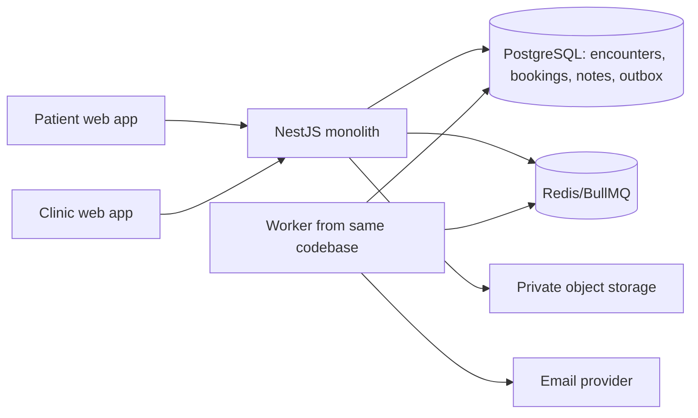

# Clinic pilot implementation blueprint

Status: implementation design and progress record, updated on 2026-09-30. The repository contains identity/contact/legal storage, gated tenant-aware intake, an appointment preview, tenant-aware clinic entry, an internal clinic Care workspace, and appointment communications with verified scheduling recovery. The booking preview covers availability, `INTAKE` → `REQUESTED` after a mandatory slot and affirmative acceptance of current published Terms/Privacy versions, and Reception confirmation to `EXPECTED`; the Care preview covers `ADMITTED` → `CARE` → `COMPLETE`, assessment snapshots, clinician notes, comments, copy and text export. Local mock PostgreSQL migrations and clinic intake, booking, general-entry and Care smoke checks passed; see the [booking preview rollout](../backend/docs/CLINIC_BOOKING_PREVIEW_ROLLOUT.md) and [entry preview rollout](../backend/docs/CLINIC_ENTRY_PREVIEW_ROLLOUT.md). Azure staging deployment and the earlier staff-profile backfill still need completion. The communications slice is implemented for local capture/restricted Resend testing; live provider and Azure staging approval remain. Approved legal copy, Canadian model-backed assessment, questionnaire and other committed features remain. See the [communications rollout](../backend/docs/CLINIC_COMMUNICATIONS_PREVIEW_ROLLOUT.md). Read the [pilot product plan](./CLINIC_PILOT_PLAN.md) for the journey and open decisions.

## 1. Architectural decision

Keep the NestJS/PostgreSQL/Redis backend as one modular monolith and keep the two React web apps. Add domain modules inside the monolith, use one database transaction for appointment/encounter changes, and run asynchronous work through the existing BullMQ infrastructure. The patient and staff apps must consume the same appointment and encounter contracts. Deploy the API and background worker from the same codebase/image if separate processes are needed for reliability; this is still one application and one database, not a service split.

The code has an emergency-department path and a gated clinic preview selected by workflow profile. Plain `./priage-dev` starts ED. `./priage-dev -t clinic` collects a clinic's name and local details, then creates a new clinic workflow instance; `--instance NAME` reopens one and `-all` operates on every registered instance. The launcher gives each local instance a separate PostgreSQL and Redis container, database, ports and auth cookie namespace. This is local test isolation. Azure pilot deployment still needs a dedicated server-side clinic ID for the pinned patient app; an internal general preview may instead use an explicit server-side clinic ID allowlist. Both use the planned shared, hospital-scoped database and deployment controls in this blueprint. Store operational state on the server. Frontend feature flags may change presentation, but the API must enforce pinning or allowlisting, permissions, and allowed transitions.

### Implemented clinic entry modes

`ClinicEntrySettings` stores the clinic's canonical patient path, general-directory listing flag and Reception walk-in policy. `ClinicEntryAlias` retains every assigned alias so a changed website or desk link resolves to the current canonical path. New clinic tenants start unlisted and appointment-only; the migration keeps the existing pilot's Reception walk-ins enabled. Clinic admins edit these fields in Settings. The workflow profile remains operator-only.

A direct `/{alias}/start` link resolves the clinic through the API and creates the bound `INTAKE` encounter, intake session and visit contact at intake start. Reception desk grants use `/{alias}/walk-in#token=…`; exchange checks the grant's tenant and one-use expiry. The link is public knowledge, not an invitation credential. The pinned API exposes only its clinic. An internal general API with `CLINIC_PREVIEW_TENANT_IDS` shows only eligible, listed clinics in the directory; unlisted allowlisted clinics remain reachable by direct link. Public clinic entry remains disabled.

The general patient funnel retains assessment before destination selection. Its unassigned draft holds the required patient-supplied visit email. Choosing an ED follows ED confirmation; choosing a listed clinic atomically attaches the completed draft to that clinic as `INTAKE`, preserving interview answers, summary, assets, session and contact. Patient booking then begins. Reception-created walk-ins may omit email and an appointment; an appointment-only clinic rejects new walk-in registration. Both patient apps require visit email independently of login email.

### UI integration for the clinic preview

The staff clinic experience uses the ED Admittance visual system: `NavBar`, dashboard background and filter panel, patient cards, status pills, search, and detail modals. Reception adds **New appointments**, **Expected**, **Arrived**, **Walk-ins**, and **Awaiting slot** as board groups. Appointment time and copy appear on a patient card; confirmation, rescheduling, arrival, decline, cancellation, and No-show appear in its detail modal only when the API allows them. Registering a walk-in uses the modal pattern of ED staff-created encounters. Availability editing belongs in Admin Settings. Care now uses the same shared navigation, cards and status language while giving the assessment the primary area and notes/comments a side area. Clinic Waiting Room and ED Triage are hidden; ED screens keep their existing statuses and actions.

The guest patient start form and assessment question screen are shared between ED and direct clinic intake. The direct clinic link changes the heading, optional fields, API start command, and destination step. Signed-in clinic patients see the same account summary and visit fields as signed-in general intake: editable visit contact email, chief complaint, and details. Account demographics are already on file; visit contact email remains independently required. The direct route resolves and binds its clinic before creating the encounter, then skips the directory and proceeds from the assessment summary to appointment times. The general route keeps its unassigned draft through assessment, offers EDs and eligible listed clinics in the directory, and attaches the draft only after a clinic is selected. It proceeds directly to booking because the patient already reviewed the assessment summary. Booking availability and legal-document reads use patient-owned visit endpoints; the visit state supplies the canonical alias for redirecting an old or mismatched link. A desk QR grant resumes the Reception-created walk-in's assessment only, with no directory or booking step.

Directory listing and Reception walk-in acceptance remain separate admin settings. A listed appointment-only clinic is valid; an unlisted walk-in clinic can still use a direct link and register patients at the desk. “Private” means absent from general search, not protected by an invitation credential. Booking and legal-document screens still have clinic-specific content because their actions differ from ED arrival; their surrounding patient style should continue to use the shared theme. The clinic Care screen extends the ED patient-detail language while centering the assessment; it does not use ED triage/vitals as the physician's primary workflow.

## 2. Current code seams and intended changes

| Concern | Existing seam | Implementation |
| --- | --- | --- |
| Patient journey | `Apps/PatientApp/src/app/Login.tsx`, `features/pre-triage/GuestChatbotPage.tsx`, `app/ClinicPatientPreview.tsx`, `ClinicBooking.tsx`, `features/pre-triage/Routing.tsx`, `backend/src/modules/clinic/*` | Direct and ED guest intake reuse the start form and assessment question screen. Direct links create a bound encounter at clinic intake start; the general funnel attaches a completed draft after destination selection. Both lead to one visit-state owner with automatic event, focus and polling refresh. Slot submission requires current published Terms/Privacy IDs and affirmative acceptance in the same transaction. Add questionnaire, verified guest recovery and approved model assessment before public entry. |
| Encounter lifecycle | `backend/prisma/schema.prisma`, clinic appointment and Care services, patient/staff status readers | `INTAKE` → `REQUESTED` → `EXPECTED` → `ADMITTED` → `CARE` → `COMPLETE` is active in the gated clinic preview. Walk-ins start at `ADMITTED`. Care completion resolves a linked appointment in the same transaction. `TRIAGE`/`WAITING` remain ED stages. Recheck remaining analytics and projections with Care in staging. |
| Clinic workspaces | `Apps/HospitalApp/src/features/clinic/ClinicReceptionBoard.tsx`, `ClinicAppointmentsPanel.tsx`, `ClinicCareView.tsx`, shared dashboard and modal components | Reception follows the ED Admittance board layout; Care follows its navigation, cards and status styles but puts assessment first. Care supports physician notes, anchored comments, open questions, copy actions and text export. Availability editing remains in Admin Settings. Exact PS-SUITE format awaits clinic approval. Waiting Room and Triage navigation are hidden for clinic tenants; ED behavior remains unchanged. |
| Tenant settings | `backend/src/modules/hospitals/hospital-config.ts`, `backend/src/modules/clinic/clinic-entry.service.ts`, `clinic-appointments.service.ts` | Typed workflow profile, clinic entry settings, alias history and separate schedule are implemented. Admins can set directory listing, walk-in policy, patient path, timezone, multiple weekly/date windows, slot length, capacity, request hold, closures and time blocks. Add questionnaire, model-context and notification settings with round-trip protection. |
| Assessment | `backend/src/modules/intake/interview/*`, `ContextItem`, `SummaryProjection`, `backend/src/modules/clinic/clinic-care.service.ts`, staff `ClinicCareView.tsx` | Versioned immutable snapshots now capture recorded Q&A, summary, provenance and recorded unasked candidates with stable segment IDs. Care APIs store source-anchored comments, revisioned/finalized notes and open questions; copy/export labels generated, patient and clinician text separately. Clinic questionnaire and approved model assessment remain future slices. |
| Guest identity | `PatientProfile`, `PatientSession`, `intake.service.ts`, `patient-auth.service.ts` | Separate contact email from login identity. Replace the fixed-password staff-created profile immediately. Give guest visits a scoped session and a verified recovery path after expiry. Link an eventual account without changing encounter ownership. |
| Background work | `backend/src/modules/jobs/*`, encounter events | A minute BullMQ job expires stale appointment requests, with a read-path expiry safeguard. Add reminder scheduling, delivery attempts, follow-up and retention jobs. Use a PostgreSQL outbox written in the same transaction as confirmation; BullMQ wakes workers, while DB rows provide recovery and idempotency. |
| Deployment | `infra/aws/production.tf`, `backend/src/common/config/production-config.ts`, `backend/scripts/production-readiness.js`, asset and audit exporters | Add an Azure deployment profile and infrastructure. Current production validation explicitly requires S3/KMS/RDS-style options, so Azure cannot pass it unchanged. Replace provider-specific gates with equivalent, tested controls, rather than disabling the gates. |

## 3. Target state and data contracts

### Encounter versus appointment

An **encounter** records the entire visit request and care journey. The clinic creates it as `INTAKE` when intake starts, with an immediately linked `IntakeSession` and visit contact. An **appointment** is a separate scheduling record and does not exist during assessment. Submitting a mandatory slot creates a `REQUESTED` appointment and moves the encounter to `REQUESTED`. Reception confirmation makes the appointment `CONFIRMED` and the encounter `EXPECTED`. Arrival makes it `ADMITTED`; physician handoff later makes it `CARE`; completion makes it `COMPLETE`. Walk-ins start at `ADMITTED` after staff registration and do not need an appointment.

| Command | Appointment | Encounter | Owner |
| --- | --- | --- | --- |
| Start clinic visit | none | `INTAKE` | Patient/guest |
| Submit available slot | `REQUESTED` | `REQUESTED` | Patient/guest |
| Confirm slot | `CONFIRMED` | `EXPECTED` | Reception |
| Mark arrival | `CONFIRMED` or none | `ADMITTED` | Reception |
| Start care | unchanged | `CARE` | Authorized clinician |
| Finish visit | `COMPLETED` if present | `COMPLETE` | Authorized clinician |
| Decline/expire/cancel/no-show | distinct appointment outcome | `CANCELLED` or `UNRESOLVED` under clinic policy | Authorized actor/job |

Walk-in assessment is available through a short-lived, one-use desk grant exchanged for an assessment-only cookie, or through staff-assisted entry by Reception/clinicians. Each answer records `PATIENT_SELF`, `WALKIN_SELF`, or `STAFF_ASSISTED` and the staff actor when applicable. An intake-scoped PostgreSQL advisory lock serializes answer advances across devices. Care handoff requires a completed assessment for routine handoff; an authorized clinician may record an urgent reason and proceed with a clearly partial snapshot. The reason stays in a tenant-scoped audit record, outside realtime event metadata.

Give appointment commands unique, explicit names (`request`, `confirm`, `reschedule`, `decline`, `cancel`, `mark-no-show`) and idempotency keys. Do not reuse `/encounters/:id/confirm`, which currently marks arrival. Persist a revision on appointment changes so old reminders can be invalidated. Use UTC instants in records and the clinic's IANA timezone for opening hours, patient display, and reminder calculation. Define daylight-saving behavior in tests.

Suggested migrations, in dependency order:

1. `ClinicWorkflowConfig` or a versioned, typed extension of `HospitalConfig`: profile (`CLINIC_APPOINTMENT`/`ED`), visible stages, timezone, schedule, holidays, capacity, hold duration, reminder policy. Only admins edit it. Preserve current config fields during migration.
2. `Appointment`, `AvailabilityRule`, `AvailabilityException`/closure, and optionally short-lived `SlotHold`. Include tenant/encounter compound relations, UTC times, revision, actor, timestamps and unique idempotency keys. Use a transaction and slot-capacity constraint or locking strategy; test parallel requests and confirmations on PostgreSQL. Define whether pending requests consume capacity for a bounded period.
3. `EncounterContact` or equivalent visit-scoped contact details, including provenance and verification status. Migrate login credentials away from required `PatientProfile.email/password` toward a separate patient identity/credential table. Do not infer that a contact address owns an account. Remove the known `00000` password path before any clinic data.
4. `QuestionnaireVersion`, `QuestionVersion` and `EncounterAnswer` (or versioned immutable JSON plus indexed answers). Publish a new version instead of rewriting questions already answered. Limit choice count to four, support optional Other, and enforce short-answer length of 300 on the server.
5. `AssessmentSnapshot`/segments, `CareNote` with version and author, `AssessmentComment` with snapshot/segment anchor and selected-text offsets, plus audit events. Keep comments valid when rendering changes; a new snapshot must not silently reanchor old comments.
6. `LegalDocumentVersion` and `VisitAcceptance` with patient/guest actor, encounter, exact terms/privacy versions, timestamp and minimal request evidence; `ClinicModelContextVersion` with author, activation and review state.
7. `NotificationOutbox`, `NotificationAttempt`, and minimal delivery status; patient federated identity links; deletion/retention work items where policy requires actual purge.

Use compound tenant relations already present on `Encounter` as the pattern for every new child table. Add indexes for clinic queue (`hospitalId`, status, requested/confirmed time), due reminders, hold expiry, and encounter comments. Use additive migrations, backfill, compatibility reads, then switch writes; migrate old status consumers before using new statuses in production.

### Proposed API surface

- Patient: the pinned preview uses `GET /clinic-intake/clinic` and `POST /clinic-intake/visits/{guest,account}`; direct links use `GET /clinic-intake/entry/:alias` and alias-bound start/desk routes. General intake uses `POST /intake/clinic-attach` after assessment. `GET /clinic-intake/visits/:id/state` returns encounter, canonical clinic alias, assessment completion, appointment/revision, readiness and allowed actions. Patient-owned `GET /clinic-intake/visits/:id/{availability,legal-documents}` binds booking reads to the encounter's tenant after either entry path. Booking commands return updated visit state and conflicts carry current state for recovery. Verified scheduling recovery is implemented with its own cookie/guard; add the configurable questionnaire next. Patient auth/session and idempotency guards are reused.
- Reception: the preview uses `GET /clinic-intake/reception`, `POST /clinic-intake/reception/walk-ins`, staff interview commands, desk-grant issue/revoke/exchange, and `GET /clinic-intake/reception/appointments`. Separate appointment commands cover confirm, decline, reschedule, cancel, no-show and arrival. Admin routes manage entry settings and schedule windows/closures/blocks; staff availability resolves from staff membership. No-show is offered only after a confirmed slot ends. Role checks and tenant scope apply to each route.
- Care: implemented under `/clinic-care`: queue, tenant-scoped encounter state and plain-text export, handoff and completion commands, version-preconditioned note save, anchored comment create/edit/resolve, open-question create/resolve, and copy metadata audit. Reads use clinical access policy and sensitive-read audit; doctor/clinical admin write, nurse reads after handoff. Clipboard contents are never sent in audit metadata.
- Admin: versioned clinic questionnaire, model context, workflow/schedule, notification templates/policy, MFA enrollment, and session/device management. Patient auth adds OIDC start/callback/link/unlink and account deletion status.

These routes are a contract proposal; settle naming in the API design before coding. Every mutation should return the new revision and public state, emit a durable encounter event, and support a safe retry. Do not put PHI in URL query strings, email links, or realtime event payloads.

## 4. Feature-by-feature implementation

### A. Clinic intake, guest and tenant-aware entry

- Patient frontend: a `ClinicVisitFlow` coordinator persists progress via backend draft APIs; screens for patient/contact, assessment, questionnaire, slots, terms, review and pending state. Account creation stays optional. Show a restart/resume path on refresh and accurate states when a request fails.
- Backend: pin `PILOT_CLINIC_ID` for a dedicated deployment or allowlist `CLINIC_PREVIEW_TENANT_IDS` for the internal general preview. Resolve alias-to-tenant on the server and reject other tenant IDs. Staff tenant checks continue through membership, never a frontend slug. Preserve a separate ED route/profile and block ED intake on the pinned clinic deployment.
- Guest session: contact email is for this encounter only. Send no booking confirmation before staff confirms; optionally send a clearly labelled request-received message only if clinic policy allows it. A short-lived, single-purpose emailed code/link can recover status or request a change after the initial session expires; rate-limit it and avoid account access through that link.
- Walk-in: Reception collects available demographic/contact information without mandatory email or account. The encounter starts arrived, and assessment can be patient self-entry via desk grant or staff-assisted. The implemented Care handoff requires completion, except for an urgent clinician override with an audited reason. Never create a login-capable account silently.
- Audit existing staff-created profiles and invalidate the shared password on any that remain, with an account recovery path for legitimate users. Removing only the creation code leaves old profiles exposed.

### B. Booking and Reception

- Implemented in gated preview through `ClinicAppointmentsService`: schedule evaluation, UTC slots in clinic timezone, capacity and bounded hold expiry, PostgreSQL advisory-lock serialization of overlapping slots and schedule edits, transaction-safe request/confirm/reschedule, no-show and cancellation outcomes, actions/events, and Reception queue projections. The patient state response and command conflict payload support recovery without relying on a manual refresh; clinic-approved change policy remains.
- Patient `ClinicBooking` displays timezone-labelled availability, current Terms/Privacy links, explicit acceptance, provisional versus confirmed status and session-bound reschedule/cancel. Clinic-approved change/cancellation policy and verified recovery after session expiry remain.
- Clinic `ClinicReceptionBoard` extends the ED Admittance board with New appointments, Expected, Arrived, Walk-ins and Awaiting slot groups. Requested/confirmed times, server-permitted actions and a hover/focus copy button are present. Availability editing lives in Admin Settings. Basic copy fields still require clinic approval for PS-SUITE.
- New appointments do not show as Expected until confirmation. Confirmation and encounter state update occur in one DB transaction; arrival is separate. Confirmation now commits its outbox and future reminders in that transaction. Local defaults capture emails; restricted provider delivery requires explicit server configuration and approval.

### C. Email, reminders and verified recovery

- Implemented `NotificationsModule`: tenant settings, versioned application templates, PostgreSQL outbox/attempts/receipts/suppressions and Resend/local capture adapters. BullMQ wakes a database sweep every 15 seconds. Confirmation/reminders commit with Reception confirmation; no initial request email is sent. Defaults are 1,440/120 minutes, up to two offsets. Past reminder times are omitted; reminders over 30 minutes late or after appointment start are cancelled.
- Exact payloads freeze at first attempt and retain a stable provider key across bounded retries. Before handing work to the provider, recheck appointment revision/status/slot, contact version/email, tenant settings and suppression. Resend keys last 24 hours; unresolved work stops at 23 hours for staff review. Signed raw-body callbacks are deduplicated, ordered and reconciled. Bounces/complaints suppress future sends until resolved. Accepted messages remain history. Acceptance is not delivery, and delivery is not reading.
- Rescheduling moves back to pending and sends a change-pending notice only when previously confirmed. Cancellation/decline/expiry of a previously confirmed request sends cancellation. Arrival, No-show and Care completion invalidate unsent reminders. Contact changes serialize under the appointment lock, increment version, revoke old recovery and rebuild applicable unsent notifications.
- Admin Settings provides enable/Reply-To/phone/offsets, template preview/test-send, captured inbox and failures/suppressions. Reception's appointment modal adds delivery history and safe known-failure retry. Ambiguous outcomes require provider review. Existing encounter events, polling and focus/reconnect refresh delivery.
- `/{alias}/appointment#ref=<opaque reference>` resolves old aliases; the reference has no access authority. Alias-bound code request/verify routes create a separate HttpOnly 24-hour scheduling recovery cookie. Codes expire in ten minutes, permit five attempts and have cooldown/email/IP limits. HMAC hashes and encrypted temporary material are stored; material is removed on use/replacement/expiry. Changes require verification within ten minutes under the command lock.
- `/clinic-intake/recovery/{state,availability,reschedule,cancel,logout}` is guarded separately from patient auth, and returns only scheduling/contact/permitted changes. Commands reuse appointment revision, UUID idempotency and current-state conflicts; recovery actor provenance is audited. Patient recovery reuses the booking slot picker and automatic polling/focus/online refresh. Ordinary patient sessions and clinical/account/assessment APIs remain independent.
- Emails omit names, complaints, assessment, notes and health identifiers. Application/DB/workers stay in the Canadian Azure monolith, while Resend recipient/content/code/event storage is explicitly documented US processing. Live delivery requires clinic approval, verified Priage sender, tracking disabled and signed callbacks; test delivery requires an exact recipient allowlist. See the [communications rollout](../backend/docs/CLINIC_COMMUNICATIONS_PREVIEW_ROLLOUT.md) and [Resend storage policy](https://resend.com/security). Post-visit follow-ups and arbitrary template editing remain later slices. Public entry gates are unchanged.

### D. Physician Care and assessment annotations

- Implemented in the gated clinic preview: `CareAssessmentSnapshot` freezes the assessment Care reads, with stable segment ids for every passage. Schema version 2 adds a deterministic clinic handoff (`clinic-handoff-rules@1`): a Clear/Caution/Escalate urgency with reasons, red flags and a red-flag screen, emergency warnings derived from the interview, next steps, up to six "Ask in the room" questions, and what the assessment couldn't establish. All of it is generated from the patient's own words, never shows CTAS, and is labelled as generated. Model-only parts (considerations, exam suggestions, timed risks) have storage and UI but stay empty and hidden. While a visit waits, a snapshot from older rules is replaced; once Care starts it is immutable. See [Clinic Care handoff](CLINIC_CARE_HANDOFF.md). `CareNote` autosave uses a version precondition and revision history; finishing finalizes it, and later changes require an amendment reason. Comments refer to snapshot id, segment id and exact quote offsets.
- The Care page leads with a "Before you go in" band (urgency, briefing, red flags, next steps, history, ask in the room), then tabs for answers (safety, clinic questions, assessment by stage with "why we asked", not asked), not established, case summary and visit record. Clinicians select any passage to comment, copy (audited) or quote into the note; headings and the side panel can't be commented on. "Your work" holds the note, comments and questions. Ticking an ask-in-room item records it as asked and adds the answer to the note. Generated items take Useful / Not right feedback; sections take "Something missing" notes. A chart composer copies or downloads chosen parts, each labelled with whose words it holds. The export stays a generic text format until the clinic approves PS-SUITE fields.
- ED triage/vitals UI remains behind the ED workflow. Clinic Waiting Room and ED Triage stay hidden. Patient Care/Complete labels and automatic state refresh now follow encounter events. Broader alert/analytics review and restricted Azure browser rehearsal remain launch checks.

### E. Questionnaire and admin model context

- Implemented: Clinic Settings has a question builder (yes/no, one choice of 2–6, short answer) with the locked safety question shown as #1, a phone preview, publish with a version check, and version history. Only admins and clinical admins publish. Published versions are immutable; an interview pins the version it started with and asks those questions right after the safety question, before the assessment's own questions. Patients who chose the clinic after a general-site assessment answer them before booking, and booking is refused until they do. Each visit keeps the exact questions and answers; Care shows them, Reception shows only whether they were answered. The one default question (travel in the last 14 days) can be reworded or removed. Existing `customIntakeQuestions` stay ED-only.
- Clinic Settings gets one exact-text model-context editor with character/token bound, save/preview and explicit activation. Preserve and show exactly what was stored. Record author/version and include the active version in each assessment. Clinical admin approval is required before a version affects patients. Separate system safety rules from tenant context and test prompt-injection, emergency escalation and fallback behavior.
- Current production config permits only deterministic assessment mode. A regional model adapter and approved deployment/data-flow review are prerequisites for AI-backed pilot assessments; until then, the deterministic path can exercise the workflow but cannot be described as a deployed AI assessment.

### F. Identity, terms and deletion

- Patient account choices: regular email/password plus Google, Apple and Facebook via an OIDC-capable identity broker or individually configured providers. [Microsoft Entra External ID](https://learn.microsoft.com/en-us/entra/external-id/customers/concept-authentication-methods-customers) is an Azure-compatible candidate, subject to region, privacy, pricing and migration review. Map provider issuer/subject to a patient identity, not email alone. Support linking a verified guest encounter to an account, collision handling, provider unlink, and recovery when a provider hides or changes email. Test all providers on the web app and preserve existing email accounts through migration.
- Staff: use existing TOTP backend enrollment/verification and device-bound session, add enrollment/recovery and trusted-device/session management UI, require MFA for pilot staff, and verify idle/absolute timeout behavior. Remembering a device must not turn MFA into a permanent bypass; a short pause should retain a valid session. SSO staff assertion path needs a real IdP integration and role/tenant mapping if used.
- Terms/privacy: publish links in the encounter confirmation screen and account page; save exact document versions and affirmative acceptance only at the final submit. The button should say **Confirm visit request** until staff confirms a time, so it does not imply an appointment exists. Clinic and legal owners must provide approved text before launch.
- Delete account: empty email confirmation input, exact-match validation, second explicit action, revoke sessions and linked identities. Differentiate deleting an account from deleting clinical encounter records. A “may remain up to 90 days” statement is only appropriate if the implemented retention/purge schedule and clinic/legal obligations make it true; make the actual policy visible in UI and test the purge/retention job.

### G. Browser cache and images

- Implement a scoped cache as a later but committed work package: server-controlled response versions, in-memory encounter list/detail cache first, then encrypted or device-managed persistent storage only after a threat review. Partition keys by tenant, staff user, session and encounter. Apply short TTL and purge on logout, account/tenant switch, session expiry, access revocation and a clinic-local 04:00 rollover. Refetch on realtime events and use the server as authority.
- Images remain in private object storage; cache only authorized thumbnails/bytes for a bounded time, never an unrestricted asset URL. Replace the current five-minute asset `Cache-Control` behavior where shared-device risk requires it. Remove the existing unbounded triage-note `localStorage` draft or move it to the same managed cache policy before the pilot.
- A scheduled 04:00 clear is a hygiene measure, not the sole privacy control: a closed browser or sleeping device can miss it. Enforce expiration when the app next starts and on every cache read.

## 5. Azure Canada deployment work

The repository currently documents and provisions AWS production resources; no Azure infrastructure is defined. Before pilot deployment, make an explicit Azure deployment manifest and validate the selected Azure services in the clinic's subscription/region. Suggested shape for an existing Azure server deployment:

| Need | Azure-oriented implementation and proof |
| --- | --- |
| App runtime | Keep the NestJS monolith and two static web builds on the existing Azure-hosted servers or move the same image to an approved Canadian-region container runtime. Give API and worker separate process roles if needed. Health checks, rolling deploy and one-off Prisma migration job are required. |
| Database | Azure Database for PostgreSQL Flexible Server in the selected Canada region, private networking/TLS, HA and tested point-in-time restore. Choose backup retention and a Canada-region disaster-recovery strategy explicitly; a geo-redundant backup option is not a complete failover plan. |
| Queue/cache | Azure Managed Redis or an approved private Redis deployment, TLS, auth, durable-enough BullMQ settings and a tested restart/reconnect. PostgreSQL remains authoritative for bookings and outbox. |
| Images | Azure Blob Storage private containers, short-lived proxy/SAS strategy, encryption, malware scan and retention. Add a `BLOB` storage provider adapter plus metadata migration and tests. |
| Audit archive | Azure Blob immutable storage/retention policy and a new audit exporter to replace S3 Object Lock assumptions. Prove archive write/read, retention and failure alerting. |
| Secrets | Azure Key Vault/managed identity where runtime supports it; rotate DB, Redis, email and model secrets. Keep secrets out of SPA builds, logs and repo. |
| Email | Resend is the selected first adapter; its US recipient/content/event storage is an explicitly documented exception to the Canadian application deployment. Require clinic approval, verified Priage domain with tracking disabled, signed receipts and test-recipient allowlisting. A future provider can replace the adapter without changing appointment transactions. |
| AI | Use deterministic mode until a clinic-approved regional model deployment is tested. If using Azure AI/Foundry, choose a **regional** Canadian deployment for the exact model; do not assume a Global/DataZone deployment keeps processing in Canada. Validate prompt/output logging, retention, abuse monitoring and access controls. |
| Operations | Update `production-config.ts`, `production-readiness.js`, CI, IaC and runbooks with Azure provider profiles and equivalent hard gates. Add backup restore, outbox recovery, queue failure, email provider outage, storage/audit archive and model fallback drills. |

Azure residency needs a data-flow inventory: primary/replica DB, backups, object storage, Redis, logs/telemetry, email content and events, AI prompts/responses, identity broker, support access and any vendor subprocessors. Keep all selectable resources in approved Canadian regions and document exceptions rather than claiming universal Canada-only processing. The selected Resend provider stores data in the US; include it in the approved external-processing inventory. Review the relevant [PostgreSQL HA](https://learn.microsoft.com/en-us/azure/postgresql/flexible-server/concepts-high-availability), [backup](https://learn.microsoft.com/en-us/azure/postgresql/backup-restore/concepts-backup-restore), [Azure Managed Redis](https://learn.microsoft.com/en-us/azure/redis/overview), [Blob immutability](https://learn.microsoft.com/en-us/azure/storage/blobs/immutable-storage-overview), [ACS privacy](https://learn.microsoft.com/en-us/azure/communication-services/concepts/privacy), [ACS email events](https://learn.microsoft.com/en-us/azure/event-grid/communication-services-email-events), and [Azure AI data privacy](https://learn.microsoft.com/en-us/azure/foundry/responsible-ai/openai/data-privacy) guidance during implementation. Region and SKU availability must be verified at deployment time.

## 6. Delivery slices and dependencies

All slices below are committed scope; the numbered order describes dependencies, not optionality. Build each as a vertical slice with schema/API/UI, migrations, observability and focused verification. Do not release a half-connected frontend or backend feature.

| Slice | Deliverable | Depends on / exit gate |
| --- | --- | --- |
| 0. Safety and contracts | Remove fixed walk-in password; document clinic decisions; typed workflow config and API/state contract; Azure target/service decision. | Security regression test; clinic owner signs off hours, hold policy, contact and copy fields. |
| 1. Encounter and identity foundation | Implemented in the gated clinic preview: `INTAKE`, pinned tenant, guest/account contact, arrived walk-ins, desk/staff assessment, status readers and concurrency serialization. | Local mock-data smoke passed; Azure restricted staging and earlier profile backfill remain before real data. |
| 2. Booking end to end | Implemented as a gated internal preview: availability, required slot request (`INTAKE` → `REQUESTED`), current Terms/Privacy acceptance, Reception confirmation (`EXPECTED`) and other actions, basic PS-SUITE copy, patient pending/confirmed screens. | Local PostgreSQL capacity/idempotency and guest refresh/retry rehearsal passed. Complete Azure restricted staging, clinic policy and paste-format review before real use. |
| 3. Communications and approved copy | Implemented gated outbox/confirmation/reminders, delivery UI and separately verified scheduling recovery; provider staging and clinic approval remain. The request transaction already records current published Terms/Privacy acceptance; publish clinic-approved copy before clinic entry. | No email before confirmation; reschedule invalidates old reminders; staged sender-domain test and legal approval. |
| 4. Care pilot | Implemented as a gated internal preview: immutable assessment snapshots, Care workspace, note autosave/history, copy and plain-text export, routine/urgent handoff, and completion. Waiting stays hidden for clinic. | Local PostgreSQL Care flow smoke passed. Restricted Azure clinician/browser rehearsal and PS-SUITE formatting approval remain. |
| 5. Configurable intake and AI | Questionnaire builder/versioning, clinic model context/versioning, approved regional AI adapter and evaluation. | Clinical review, fallback and prompt-injection test set pass. |
| 6. Expanded care and outbound | Anchored comments, note amendments, clinic completion, and No-show were implemented ahead of this slice in the gated preview. Add post-visit follow-ups and refine clinician-reviewed export/annotation ergonomics. | Staged clinicians confirm anchors and text transfer; follow-ups respect purpose and policy. |
| 7. Identity and cache | Google/Apple/Facebook patient sign-in, staff MFA/device UI, deletion/purge workflow, managed encounter/image cache. | Account linking and device/session tests; privacy/retention review; cache purge tests. |
| 8. Azure launch and pilot | Azure storage/audit adapters, production gates/IaC, monitoring, restore/incident drills, clinic UAT and deployment. | All prior slices pass, with real clinic configuration and no real PHI in test evidence. |

Some work in slices 5–7 can run in parallel after the shared contracts stabilize. A smaller internal rehearsal may exercise the core path earlier, but the full-scope pilot launch gate includes every requested feature.

## 7. Verification and launch evidence

- Contract tests for every lifecycle transition and status projection across patient app, Reception, Care, alerts, analytics and realtime. Include ED regression tests.
- Clinic entry tests for listed/unlisted directories, alias history, server allowlisting, forged IDs, appointment-only walk-in policy, desk-grant tenant matching, and general-draft handoff with answer/contact preservation and safe retry.
- UI checks for pinned and general alias routes, automatic visit-state refresh and revision conflict recovery, multiple weekly/date schedule windows, and No-show visibility after slot end. The local smoke scripts are `test:clinic-intake-smoke`, `test:clinic-booking-smoke`, and `test:clinic-entry-smoke`; the last uses a general preview API with `CLINIC_PREVIEW_TENANT_IDS`.
- PostgreSQL integration tests for slot capacity, simultaneous requests, duplicate retries, expiry, confirmation/reschedule/cancellation, no-show and timezone/DST cases.
- Notification tests for transactional outbox, send-before-confirm prevention, deduplication, provider timeout ambiguity, bounce/retry, revised appointments and follow-ups.
- Access tests for guest recovery, account linking, staff membership/clinical assignment, MFA and device revocation, cross-tenant IDs, comments/notes and image reads.
- Browser journeys for guest and account patients, walk-in, unconfirmed to Expected to Reception to Care, copied fields, comments, deletion and shared workstation cache expiry.
- Azure staging evidence: environment readiness, database restore, audit archive immutability, Blob scan/delete, Redis reconnect, email domain/delivery, regional model/fallback, log redaction and on-call response. Revisit [clinical governance](./CLINICAL_GOVERNANCE.md), [data lifecycle](./DATA_LIFECYCLE_AND_AUDIT_POLICY.md) and [operations](./PRODUCTION_OPERATIONS.md) with the clinic's actual contracts and approved retention schedule.

## 8. Decisions to record before coding the affected slice

1. Actual Azure hosting shape and selected Canadian region(s); allowed cross-region backup, identity, email and AI processing.
2. Clinic hours, timezone, slot length/capacity, hold expiry, reschedule/decline/no-show/cancellation rules and reminder offsets.
3. Which data fields are required for guest/contact and walk-in intake; whether contact email verification is required before submitting a request.
4. Exact PS-SUITE paste format and who verifies that the pasted chart belongs to the right patient.
5. Terms/privacy document owner and versions, account/encounter retention obligations, deletion wording and post-visit communication policy.
6. Clinical owner for assessment prompt/context approval, model choice, evaluation set and safety escalation behavior.

Record each decision in the product plan and turn it into a migration/configuration/test acceptance criterion. None requires splitting the monolith.
